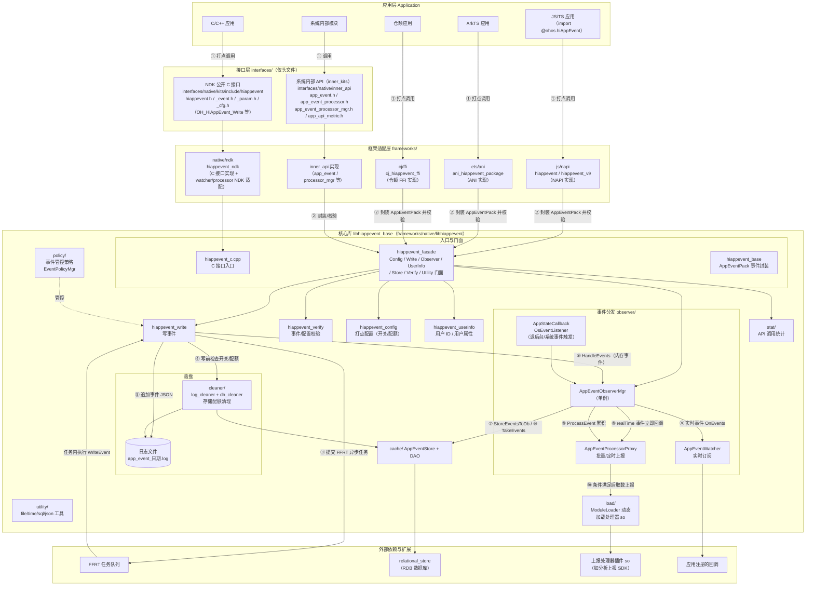
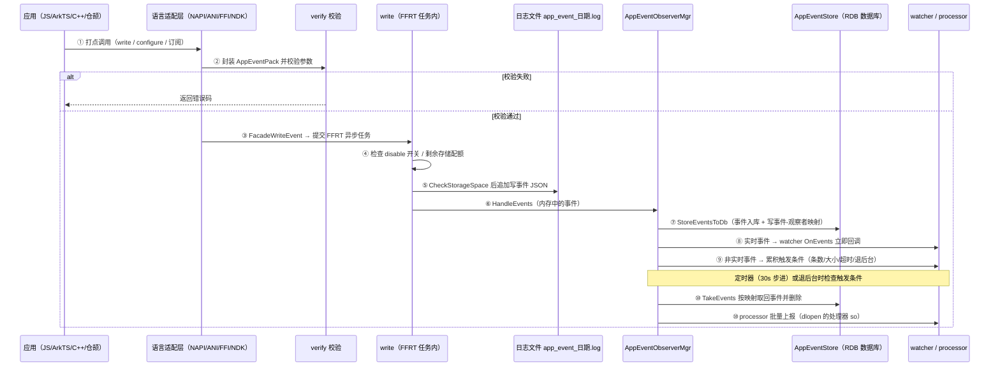
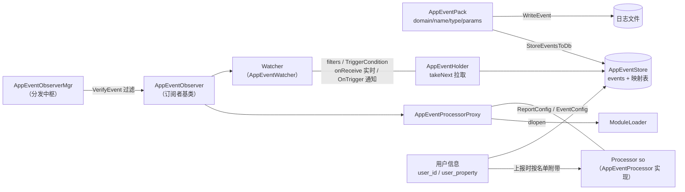
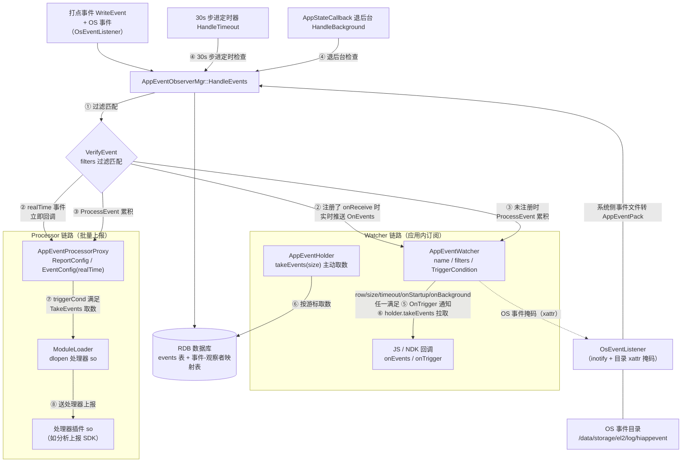
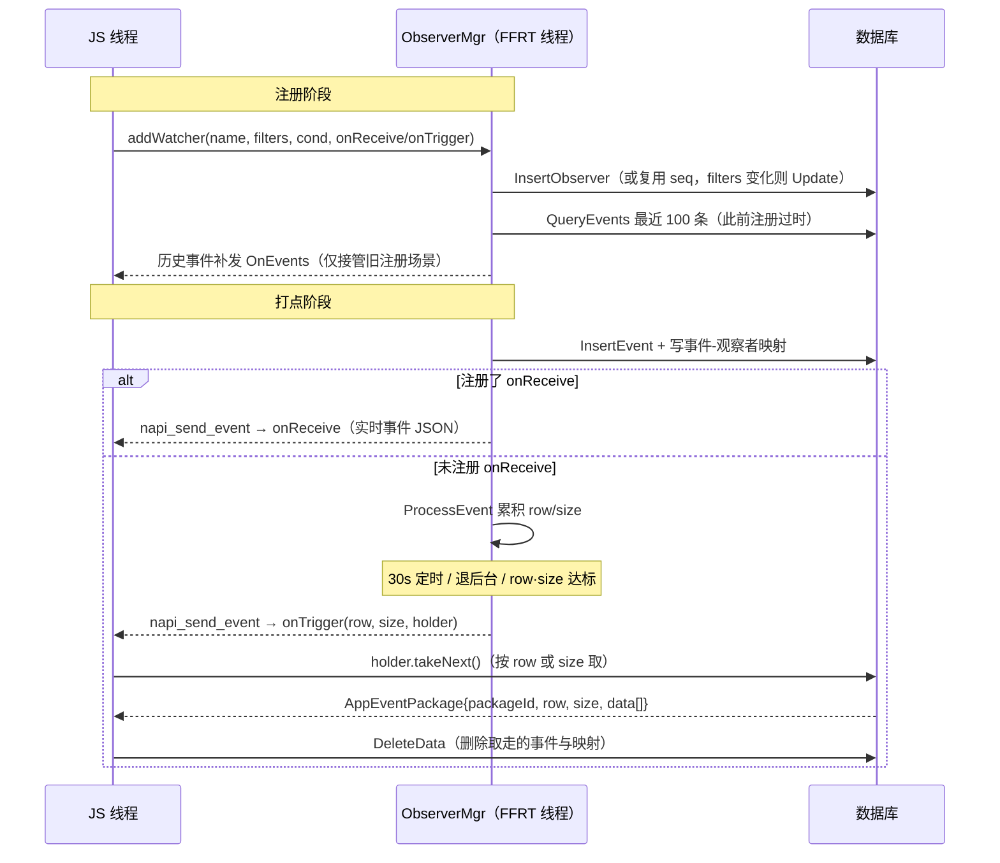
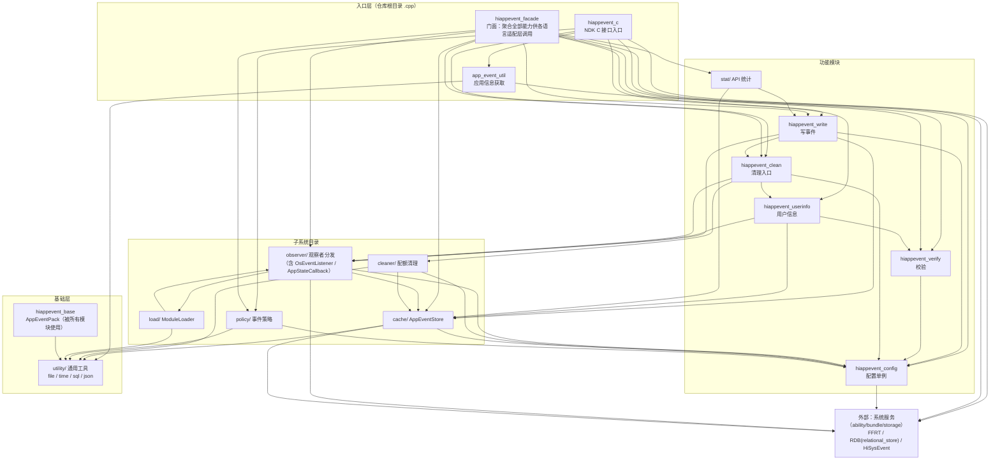

# HiAppEvent（含 Hiview event_publish）架构分析

> 分析对象：
> - `base/hiviewdfx/hiappevent`（应用事件打点组件）
> - `base/hiviewdfx/hiview/base/event_publish`（Hiview OS 事件投递回应用的桥接层，属同一主题的反向链路）
>
> **本文档由 ZCode（AI 编程助手，底层模型 GLM-5.3，由 Z.ai 训练）基于上述仓库源码分析生成**，所有结论均以代码为依据（关键处标注了文件与行号）。
> 版本：2026-09-10 初版（原理/接口/功能/改进/FAQ/速查）；2026-09-21 合并结构总结并重排（架构图、时序编号、关键概念、链路执行细节、Processor 深挖、模块关系图）。

**文档结构（由总到分）：**

1. [背景与总体架构](#1-背景与总体架构)——是什么、怎么设计的
2. [目录结构](#2-目录结构)——代码在哪
3. [关键概念](#3-关键概念)——术语表
4. [事件与消费方式分类](#4-事件与消费方式分类)
5. [对外接口](#5-对外接口)——5 条接入路径 + event_publish 接口
6. [功能清单](#6-功能清单)
7. [功能链路分析](#7-功能链路分析)——打点/回调/投递三条链路与代码级执行逻辑
8. [代码架构与模块关系](#8-代码架构与模块关系)——分层、设计模式、模块依赖
9. [构建产物与依赖](#9-构建产物与依赖)
10. [测试结构](#10-测试结构)
11. [改进方向](#11-改进方向)
12. [避坑与 FAQ](#12-避坑与-faq)
13. [调试与速查](#13-调试与速查)——调试技巧、能力矩阵、版本演进、速查手册
14. [端到端示例代码](#14-端到端示例代码)

附录：关键文件索引

---

## 1. 背景与总体架构

### 1.1 背景与定位：这套机制解决什么问题

OpenHarmony DFX（Design for eXperience，可靠性/可诊断性）子系统是一组面向"运行时问题诊断"的组件：`hilog`（通用日志）、`hisysevent`（系统事件，面向系统服务）、`hiappevent`（应用事件，面向应用）、`hiview`（事件收集/加工/分发中枢）、`faultloggerd`（崩溃日志采集）。

**HiAppEvent 的定位**：面向应用层的事件打点框架，让应用记录运行中的故障/统计/安全/行为事件，并提供"持久化 + 本地观察 + 云端上报"的完整能力链。

**与 hisysevent 的边界**：hisysevent 面向系统服务进程（uid<20000），hiappevent 面向应用进程（uid≥20000）；`hiappevent_verify.cpp` 的 `IsApp()` 校验（`getuid()>=20000` 且 ApplicationContext/bundleName 有效）确保只在应用进程生效，系统进程调用 write 直接返回 `ERROR_NOT_APP`（-200）。

**为什么还要 event_publish**：有一类特殊事件——**OS 域应用类事件**（APP_CRASH/APP_FREEZE/MAIN_THREAD_JANK 等）。它们由系统侧（Hiview + faultloggerd）产生，因为崩溃/卡顿发生在应用进程内，但**应用自己此时往往已无法打点**（进程已死或主线程冻结）。这类事件需要"反向投递"回应用，让应用感知到自身的故障。这就是 `hiview/base/event_publish` 存在的根本原因。

**一句话概括两个方向**：
- **正向**：应用活着时主动打点（应用 → 系统持久化 → 应用自己观察/上报）。
- **反向**：应用死了/卡了，由系统代为打点并投递回应用（系统 → 应用沙箱 → 应用感知）。

### 1.2 官方三层架构图

官方 README 中的架构图（`figures/HiAppEvent架构图.png`）为简化的三层结构：

```
┌─────────────────────────────────────┐
│           Application               │
│  ┌───────────────────────────────┐  │
│  │        JS application         │  │
│  └───────────────────────────────┘  │
└──────────────────┬──────────────────┘
                   │ 调用
                   ▼
┌─────────────────────────────────────┐
│           Logging API               │
│  ┌───────────────────────────────┐  │
│  │        HiAppEvent API         │  │
│  └───────────────────────────────┘  │
└──────────────────┬──────────────────┘
                   │ 依赖
                   ▼
┌─────────────────────────────────────┐
│             Library                 │
│  ┌───────────────────────────────┐  │
│  │        HiAppEvent lib         │  │
│  └───────────────────────────────┘  │
└─────────────────────────────────────┘
```

### 1.3 组件详细架构图（按代码实际结构）



> 注：标号 ①–⑩ 为一次打点从调用到消费的主时序。⑧ 与 ⑨ 是并行的两条消费分支：⑧ 实时推送，⑨ 累积后在条件满足时执行 ⑩ 批量取数上报；⑩ 阶段才会经 ⑦ 存入的数据 `TakeEvents` 取回。

### 1.4 两条链路 + 同一个分发中枢

**核心洞察**：这套机制处理"事件从产生到被应用感知"的问题。难点在于——有些事件应用自己能打（应用活着），有些事件应用打不了（应用崩溃/卡死，进程已不在）。所以分成两条链路，但它们最终都汇入应用进程内的**同一个分发中枢 `AppEventObserverMgr`**，让应用注册的 Watcher 用同一套方式接收，无需区分事件来源。

**交汇的本质不是"文件落在同一目录"，而是两条链路都进入应用进程内的 `AppEventObserverMgr` 这一个中枢**。链路 1 是应用进程内直接调用 `HandleEvents`；链路 2 是跨进程，靠"文件落沙箱 + inotify 感知"把跨进程事件桥接回应用进程，再经两条子路径进入中枢（见下）。所以应用只需注册一次 Watcher，就能同时收到自己打点和系统投递的两类事件。

#### 用一个完整场景走通全过程：应用发生 Native 崩溃

这是理解整条反向链路的最佳例子（应用已死、必须系统代打并投递）：

```
① 崩溃发生。应用进程已死，应用自己无法打点。
        │
② faultloggerd 采集崩溃日志(cppcrash) → Hiview 的 FaultlogCppCrash 插件加工成 APP_CRASH 事件
        │
③ 插件调 EventPublish::PushEvent(uid, "APP_CRASH", FAULT, json)  ← 此时在 Hiview 进程
        │   ├→ 经 BundleMgr 把 uid 反解成目标应用沙箱路径
        │   ├→ 读应用沙箱 xattr "user.appevent" 的 bit0，确认应用订阅了 APP_CRASH
        │   ├→ 把事件 JSON 写入应用沙箱 cache/hiappevent/hiappevent_<ts>.txt
        │   └→ 把崩溃日志复制到应用沙箱 log/hiappevent/，建硬链接，用 ACL 授权应用可读
        │
   投递完成。但应用此刻是死的，无法感知 —— 事件文件就留在沙箱里。
        │
   ······（时间错位：要等应用再次启动并 addWatcher）······
        │
④ 应用下次启动。libhiappevent 初始化，OsEventListener 构造时 Init() 扫描 cache/hiappevent 下
   积压文件 → 解析 → InsertLinkEvents 把带 external_log 的事件入库为 link event 并暂存到
   historyLinkEvents_ → 删除源文件；同时经 StartListening→RegisterDirListener 创建 inotify 线程
   （线程名 OS_AppEvent_Ls）监听后续新文件
        │
⑤ 应用 addWatcher 监听 APP_CRASH。AppEventObserverMgr::InitWatcherFromListener 发现该 watcher
   已在 DB 注册(isExist) → GetLinkEvents 取走暂存的 historyLinkEvents_ →
   StoreLinkEventMappingToDb 存映射 → QueryEvents 从 DB 查该 watcher 的事件 →
   SendEventsToObserver 发给 watcher
        │
⑥ 应用注册的 Watcher.onTrigger / onReceive 收到崩溃事件 + external_log 路径
```

> **注意第⑤步的前提**：崩溃前应用必须已注册过该 watcher（DB `observers` 表有记录），重启后 addWatcher 同名 watcher 时 `isExist=true` 才触发积压处理。若应用从未注册过 watcher，积压文件会在 Init 时被解析删除但不会分发给任何 watcher。

#### 运行时子路径：应用存活、inotify 感知新文件

崩溃场景走的是"启动时扫描积压"子路径。另一条是应用存活时（如 MAIN_THREAD_JANK 卡顿但未死），event_publish 投递新文件后：

```
Hiview 投递新 hiappevent_*.txt → OsEventListener 的 inotify 线程 HandleInotify 感知
   (IN_MOVED_TO | IN_CLOSE_WRITE) → GetEventsFromFiles 解析 →
   AppEventObserverMgr::HandleEvents 分发 → Watcher.onTrigger / onReceive
```

> **两条子路径的区别**：启动时积压走 `Init→GetLinkEvents→SendEventsToObserver`（发给已注册的单个 watcher，绕过 HandleEvents）；运行时新文件走 `HandleInotify→HandleEvents`（分发给所有匹配 watcher）。两者都进入 `AppEventObserverMgr` 这个中枢，对 watcher 透明。

#### 对比：应用活着时自己打点（路径短得多）

```
应用 write  →  校验  →  FFRT 异步写 app_event_*.log + appevent.db
                                  │
                                  └→ AppEventObserverMgr::HandleEvents  （同进程，几乎实时）
                                        ├→ Watcher.onTrigger / onReceive
                                        └→ ProcessorProxy → 上云
```

#### 两条链路的本质差异

| 维度 | 链路 1（正向·应用主动） | 链路 2（反向·系统给应用） |
|---|---|---|
| 触发者 | 应用自己 | Hiview 系统进程 |
| 执行进程 | 应用进程内完成 | Hiview 进程投递 + 应用进程感知 |
| 是否同步 | 是（同进程直接调 `HandleEvents`） | 否，跨进程，靠文件系统 + inotify 桥接 |
| 时间关系 | 打点即分发（近实时） | 投递与感知可能错位：应用死了要等下次启动**且 addWatcher** 才感知；应用卡但未死（如 MAIN_THREAD_JANK）则 inotify 近实时感知 |
| 数据落点 | `app_event_*.log` + `appevent.db` | `hiappevent_<ts>.txt` + `log/hiappevent` 外部日志 |
| 入口 | `WriteEvent` → `HandleEvents` | `EventPublish::PushEvent` → 应用侧 `OsEventListener`（运行时 `HandleInotify`→`HandleEvents`；启动时 `Init`→`GetLinkEvents`→`SendEventsToObserver`） |

#### 为什么这样设计（一句话）

应用侧 `libhiappevent_base` 只暴露一个分发中枢 `AppEventObserverMgr`，**把"事件来自哪里、何时到达"这些复杂性藏在桥接层（inotify 扫描 + GetLinkEvents 暂存）里**，对应用 Watcher 透明——这正是"两条链路一个中枢"设计的价值。

### 1.5 事件数据流时序（正向链路）



文字版数据流（标号与上图一致）：

```
① 各语言入口（NAPI / ANI / 仓颉 FFI / NDK / innerAPI）发起打点调用
        │
② 封装为 AppEventPack，hiappevent_verify 校验
   （参数/配置不合法直接返回错误码）
        │
③ hiappevent_write：SubmitWritingTask 提交 FFRT 异步任务
   （队列由 ObserverMgr 持有）
        │
   ④ 任务内执行 WriteEvent：检查 disable 开关与剩余配额，
      HiAppEventClean::CheckStorageSpace 清理
   ⑤ 事件 JSON 追加写入日志文件 app_event_日期.log
        │
⑥ AppEventObserverMgr::HandleEvents
⑦ StoreEventsToDb：事件写入 RDB 数据库（合并自定义事件参数），
   并写事件-观察者映射表
        │
   ⑧ 实时消费分支：
      ├──► watcher（注册了 onReceive）：OnEvents 立即回调
      └──► processor（EventConfig.realTime）：立即回调处理器
   ⑨ 非实时事件累积，等待触发条件
      （row / size / timeout 30s 步进 / onStartup / onBackground）
        │
⑩ 条件满足后 TakeEvents 从数据库按映射取回事件并删除，
   交由 dlopen 加载的处理器 so 批量上报
```

### 1.6 关键设计原理（为什么这么设计）

**① 为什么多语言统一到单一核心库 `libhiappevent_base`？**
NDK/NAPI/Cangjie/ANI/inner_api 五条接入路径差异巨大（C 过程式、JS 对象式、C++ 对象式），但事件打点的核心逻辑（校验/落盘/分发/清理）只有一份。统一到单一核心库保证：行为一致性、bug 只修一处、ABI 通过 map 版本脚本严格治理。代价是各语言层都要写一层"薄转调"路由（`hiappevent_ndk.c`/`HiAppEventImpl`/`HiAppEventAni`），但换来核心稳定。

**② 为什么用门面（Facade）+ 单例？**
内部有 10+ 个管理器/单例（Config/ObserverMgr/Store/UserInfo/EventPolicyMgr/...），若让上层直接调这些散点，接口会随实现变动而漂移。7 个 `*Facade` 静态类把它们聚合成稳定的对外面，配合 `libhiappevent_base.map` 白名单导出，实现"内部可自由重构、对外 ABI 兼容"的解耦。单例则因为事件系统天然全局唯一（一个进程一份 DB、一份观察者表、一份配置）。

**③ 为什么 log 文件 + DB 双写？**
- `app_event_*.log`（JSON 行）：**人可读**，开发者直接 `cat` 即可看事件，便于排查；但难查询、难聚合。
- `appevent.db`（7 张表）：**可查可聚合**，processor 上报时按条件取 ≤100 条、按 observer 映射精确分发；但不可直接读。
两者互补：人看 log、机器读 db。代价是双写空间和一致性，靠"每 1000 事件检查配额 + 逆序清理"兜底。

**④ 为什么观察者 + 策略 + 代理三者组合？**
这是事件系统的三个正交关注点：
- **观察者**（observer/）回答"谁关心这个事件"——Watcher（本地）与 ProcessorProxy（上报）是两类订阅者。
- **策略**（policy/）回答"这个事件如何采集配置"——崩溃要不要 minidump、卡顿采样几次，与"谁订阅"无关。
- **代理**（ProcessorProxy）回答"如何把事件交给外部 processor 并附加增强"——版本缓存、过滤、DB 查询，不污染外部 processor 的简单契约。
三者解耦，各自独立演进。

**⑤ 为什么用 xattr 位掩码标记 OS 事件订阅？**
应用订阅 OS 事件（`addWatcher` 监听 APP_CRASH）发生在**应用进程**，而投递发生在 **Hiview 进程**，跨进程。xattr（扩展属性）写在应用沙箱目录上，是**文件系统级的跨进程通信**：应用侧写位、Hiview 侧读位，无需 IPC、无需 Hiview 维护订阅表、应用卸载/重装沙箱清空自动失效。用位掩码（uint64）而非 JSON 是极致轻量。代价是只有 64 位容量（现用 bit0-8、10-14：应用侧 14 种事件，Hiview 读表 13 种，bit9 空缺）。

**⑥ 为什么 event_publish 用文件系统投递而非 IPC/CommonEvent？**
- **沙箱隔离**：事件和日志必须落到目标应用的私有沙箱，文件系统天然按 uid 隔离，IPC 反而要处理权限。
- **ACL 授权**：崩溃日志属 hiview uid，应用要读必须授权；`StorageDaemon::AclSetAccess` 设 ACL 是文件系统操作，与投递同构。
- **生命周期解耦**：Hiview 投递时应用可能没在运行（刚崩溃），文件落盘后应用下次启动仍能读；IPC/CommonEvent 是即时的，应用不在就丢。
- **链接事件**：多观察者各读一份日志，用 `link(2)` 硬链接比 IPC 多次复制更省空间。
代价是延迟（inotify 感知非即时）和 SCROLL_JANK 等 30s 批量搬移。

**⑦ 为什么 FFRT 异步、write 非阻塞？**
打点是高频路径（用户操作、崩溃埋点），若同步落盘+分发会阻塞业务线程。`SubmitWritingTask` 把 `WriteEvent` 投递到 `AppEventObserverMgr` 的 `ffrt::queue`，调用方立即返回。代价是返回值不反映"已落盘"，只反映"校验结果"——这是为什么 write 返回 0 表示"校验通过已异步写入"而非"已写入"。

**⑧ 为什么 userId/userProperty 用版本号缓存？**
processor 每次上报会取最新用户信息，但用户信息变更频率低。`UserInfo` 维护 `userIdVersion_`/`userPropertyVersion_`，`ProcessorProxy` 缓存本地版本，只有版本变了才重查——避免每次上报都查 DB。这是"读多写少"场景的典型版本号缓存。

**⑨ 为什么三档分发策略（立即/异步/延迟批量）？**
不同 OS 事件对时延和体积的诉求不同：
- **立即**（APP_CRASH 等）：故障要尽快让应用感知，且单条体积小。
- **RESOURCE_OVERLIMIT 异步线程**：泄漏日志可达 2GB，复制耗时长，不能阻塞投递主流程。
- **SCROLL_JANK/BATTERY_USAGE 延迟 30s 批量**：这类事件高频但单条价值低，立即落盘会产生大量小文件 + 频繁 inotify 唤醒；先攒 temp 再批量搬移，用时间换 I/O 次数。

**⑩ 为什么 processor 用 dlopen 动态加载？**
上报策略（路由、 appId、鉴权）因厂商/产品而异，且可能依赖云端 SDK。把 processor 实现成独立 `.so`（`lib<name>.z.so`），运行期 `ModuleLoader::dlopen` 加载，让"核心打点库"与"上报策略"解耦——同一份 hiappevent 可配不同 processor 适配不同上报通道。代价是 `.so` 缺失时的容错（返回 -8 PROCESSOR_NOT_FOUND）。

---

## 2. 目录结构

### 2.1 hiappevent 仓库

```
/base/hiviewdfx/hiappevent
├── bundle.json              # 部件定义（名称、依赖组件、构建目标、inner_kits）
├── hiappevent.gni           # 构建配置
├── hiappevent_aafwk.gni     # 构建配置
├── figures/                 # README 配图（官方架构图）
├── interfaces/              # 对外接口存放目录
│   └── native
│       ├── kits/include/hiappevent    # NDK 公开 C 接口头文件
│       │   ├── hiappevent.h           # OH_HiAppEvent_Write / Configure 等主接口
│       │   ├── hiappevent_event.h     # 预定义事件名常量
│       │   ├── hiappevent_param.h     # 参数列表构造接口 + 预定义参数常量
│       │   └── hiappevent_cfg.h       # 配置项常量（DISABLE / MAX_STORAGE）
│       └── inner_api                 # 系统内部 API（hiappevent_innerapi）
│           ├── include/app_event.h              # AppEventPack 事件封装
│           ├── include/app_event_processor.h    # 处理器接口
│           ├── include/app_event_processor_mgr.h# 处理器管理
│           ├── include/app_api_metric.h         # API 指标
│           └── include/base_type.h              # 基础类型定义
├── frameworks/              # 框架实现代码
│   ├── native
│   │   ├── libhiappevent    # ★ 核心 native 库（libhiappevent_base）
│   │   └── ndk              # NDK C 接口实现（hiappevent_ndk）
│   ├── js/napi              # JS 接口的 NAPI 实现（hiappevent / hiappevent_v9）
│   ├── ets/ani              # 基于 ANI 的 ArkTS 原生实现（ani_hiappevent_package）
│   └── cj/ffi               # 仓颉语言 FFI 实现（cj_hiappevent_ffi）
└── test                     # 测试用例代码
    ├── unittest/common/native   # C++ 单元测试（config/cache/verify/policy/observer 等）
    ├── unittest/common/napi     # JS 接口测试
    ├── processor                # 测试用处理器插件（验证动态加载流程）
    └── resource                 # 测试资源
```

### 2.2 hiview/base/event_publish（反向链路桥接层）

```
/base/hiviewdfx/hiview/base/event_publish
├── event_publish.cpp(.h)              # 主入口：EventPublish::PushEvent / IsAppListenedEvent
├── app_event_handler.cpp(.h)          # 7 类事件载荷封装（AppLaunch/ScrollJank/...）与 PostEvent
├── app_event_publisher_factory.cpp    # 插件注册表（由 hiview_platform.cpp 装配）
├── log_file_name_converter.cpp        # memleak/fdleak 日志名规范化（26 种正则）
├── user_data_size_reporter.cpp        # 用户数据量上报（24h 限频）
├── app_event_publish_unable.cpp       # 裁剪场景桩实现（hiview_appevent_publish_enable 开关）
└── ...                                # 以 ohos_source_set("hiview_event_publish") 编入 hiview 主产物，非独立 so
```

---

## 3. 关键概念

### 3.1 事件模型概念

| 概念 | 定义 | 关键细节 |
|------|------|----------|
| domain（事件领域） | 事件的第一级归属标识，与 name 一起唯一定位一个事件 | 长度 ≤32，仅字母/数字/下划线/$（`hiappevent_verify.cpp`）；OS 域事件固定 `DOMAIN_OS = "OS"` |
| EventType（事件类型） | 事件的四级分类，落盘为 `type_` 字段 | FAULT=1 故障、STATISTIC=2 统计、SECURITY=3 安全、BEHAVIOR=4 行为 |
| AppEventPack（事件包） | 核心数据结构，一个打点事件在内存/库中的完整载体 | 字段：`domain_`/`name_`/`type_`/`time_`（毫秒时间戳）/`params_`/`seq_`（入库序号）；`GetEventStr()` 输出 JSON；参数值基于 `std::variant` 支持 17 种类型 |
| ParamList（NDK 参数列表） | NDK 打点用的参数链表抽象 | 实现上就是 `AppEventPack*` 的重解释（`hiappevent_c.cpp` 中 reinterpret_cast） |
| 打点校验规则 | `hiappevent_verify.cpp` 对事件与配置的约束 | 事件名 ≤48、参数名 ≤32、参数 ≤32 个、数组参数 ≤100 项、字符串参数 ≤8K（crash/anr 参数名特例 1M）、watcher 名 ≤32 |

### 3.2 写入侧概念

| 概念 | 定义 | 关键细节 |
|------|------|----------|
| HiAppEventConfig（打点配置） | 打点行为配置单例 | disable 开关、maxStorage 存储配额（默认 10M）、storageDir、runningId |
| FFRT 写任务 | 打点的异步执行载体 | `SubmitWritingTask` 提交到 FFRT 队列（队列由 ObserverMgr 持有），任务内执行 `WriteEvent` |
| AppEventStore / DAO | 数据库访问层（cache/） | 表：events（事件）、事件-观察者映射、observer（订阅者注册）、custom_event_param、user_id、user_property、api_stats |
| custom_event_param（自定义事件参数） | 按 domain 预置的公共参数（`setEventParam`） | 不落日志文件；仅入库，后续该 domain 事件入库时由 `QueryCustomParamsAdd2EventPack` 合并 |
| user_id / user_property（用户信息） | 应用维度的用户标识与属性 | 库名 ≤256，user_id 值 ≤256、user_property 值 ≤1024；processor 上报时按 `userIdNames`/`userPropertyNames` 名单附带 |
| cleaner（清理器） | 存储配额管理（cleaner/） | log_cleaner 删旧日志文件 + db_cleaner 清旧库数据；每 1000 事件检查一次，超限逆序清理（DB 保留最近 1000 条 / OS 域 150 条） |
| policy（事件策略） | 按事件名下发的管控策略（policy/，EventPolicyMgr 管理） | 内置 6 类策略 10 个注册名：app_crash、app_freeze、cpu_usage_high、main_thread_jank、resource_overlimit、address_sanitizer（配置项明细见 13.4.7） |

### 3.3 订阅分发侧概念

| 概念 | 定义 | 关键细节 |
|------|------|----------|
| AppEventObserver（观察者基类） | 所有事件订阅者的抽象基类 | 关键方法：`OnEvents`（批量回调）、`OnTrigger`（条件满足通知）、`VerifyEvent`（过滤）、`IsRealTimeEvent`（默认 false）、`ProcessEvent`/`ProcessTimeout`/`ProcessStartup`/`ProcessBackground`（条件累积与触发） |
| AppEventObserverMgr（观察者管理器） | 分发中枢单例（observer/） | `HandleEvents`（入库+映射+分发）、`HandleTimeout`（30s 步进定时器）、`HandleBackground`（退后台）；持有 FFRT 队列、ModuleLoader、OsEventListener、AppStateCallback |
| Watcher（订阅器） | 应用内订阅者，核心类 `AppEventWatcher` | 组成：name + filters + triggerCondition + 回调；**是否实时取决于是否注册 `onReceive`** |
| AppEventFilter（事件过滤器） | 订阅时的事件筛选条件 | domain + names 集合 + types 位掩码；domain 为 `DOMAIN_OS` 时按 `OS_EVENT_POS_INFOS` 生成 OS 事件掩码（位表见 7.5） |
| TriggerCondition（触发条件，`base_type.h`） | 订阅/上报的触发时机 | row 条数、size 大小（仅 watcher.onTrigger）、timeout 周期（30s 步进）、onStartup 启动、onBackground 退后台，任一满足即触发 |
| AppEventHolder（事件持有器） | 应用侧从数据库分批取事件的句柄 | JS：`setRow`/`setSize`/`takeNext()`；NDK 对应 `OH_HiAppEvent_TakeWatcherData` |
| Processor（上报处理器） | 实现上报逻辑的动态库 so | 实现 `AppEventProcessor` 接口：`OnReport`（批量上报，含 userIds/userProperties/events）、`ValidateUserId`/`ValidateUserProperty`/`ValidateEvent`；处理器名 ≤256（深入解析见 7.4） |
| ModuleLoader（模块加载器） | 处理器 so 的动态加载器（load/） | 按名称 dlopen/dlclose；处理器名称来源于 processor_config 配置（`processor_config_loader`） |
| AppEventProcessorProxy（处理器代理） | Observer 与具体处理器 so 之间的代理 | 管理该处理器的 ReportConfig / EventConfig，执行 realTime 判断与条件触发上报 |
| ReportConfig（上报配置，`base_type.h`） | processor 的整体配置 | name、debugMode、routeInfo（上报地址）、appId、triggerCond、userIdNames/userPropertyNames、eventConfigs、configId、customConfigs（≤32 项）、configName |
| EventConfig（事件级上报配置） | processor 对单个事件的上报策略 | domain + name + isRealTime（实时事件立即回调处理器） |
| OsEventListener（系统事件监听器） | OS 事件的引入通道 | inotify 监听系统侧 hiappevent 目录，事件文件解析为 AppEventPack；经目录 xattr（`user.appevent`）维护 watcher 的 OS 事件掩码 |
| AppStateCallback（应用状态回调） | 前后台切换感知 | 退后台时触发 `HandleBackground` 检查 onBackground 条件 |
| external_log | 事件附带的崩溃/泄漏日志文件 | 复制 + 硬链接到应用沙箱，ACL 授权应用可读（落盘规则见 7.5） |
| pathHolder | uid 反解出的沙箱路径占位符 | 含克隆（`+clone-<idx>+<bundleName>`）/扩展（如输入法）/原子服务变体 |

### 3.4 概念关系图



---

## 4. 事件与消费方式分类

### 4.1 按事件分类

**按事件类型（EventType，落盘 `type_` 字段）：**

| 类型 | 值 | 用途 |
|------|----|------|
| FAULT | 1 | 故障类事件（崩溃、卡死、异常等） |
| STATISTIC | 2 | 统计类事件（使用频率、时长等） |
| SECURITY | 3 | 安全类事件（漏洞、签名异常等） |
| BEHAVIOR | 4 | 用户行为类事件（登录、页面操作等） |

**按事件来源：**

| 来源 | 写入方 | 通道 |
|------|--------|------|
| 应用自定义事件 | 开发者（`write`，domain/事件名自定义） | 常规打点链路（日志文件 + 数据库） |
| 预定义事件 | 开发者（固定事件名常量） | 同上 |
| OS 系统事件（`DOMAIN_OS`） | 系统侧写入事件文件，`OsEventListener` inotify 感知 | 反向链路；watcher filters 中 domain 为 `DOMAIN_OS` 的订阅生成 OS 事件掩码 |
| API 指标事件 | stat/ 模块（内部） | api_stats 聚合与指标上报 |
| 跨框架内存异常（`FW_MEM_ANOMALY`） | 跨框架运行时（Flutter Dart / RN Hermes / KMP） | 经 HiSysEvent 直报，不走常规落盘 |

### 4.2 按消费方式分类

| 消费方式 | 适用对象 | 机制 |
|----------|----------|------|
| 实时推送（OnEvents） | 注册了 `onReceive` 的 watcher；配置了 `realTime` 的 processor 事件（EventConfig） | `IsRealTimeEvent` 为 true，事件匹配后立即回调 |
| 条件触发通知（OnTrigger） | 所有 watcher / processor | `ProcessEvent` 累积 row/size，与 timeout（30s 步进）、onStartup、onBackground 共 5 种条件任一满足时通知，数据仍留在数据库 |
| 主动拉取 | 应用侧 | JS `holder.takeEvents(size)` / NDK `TakeWatcherData`，按 seq 从数据库取走并删除映射 |
| 批量上报 | 处理器 so | triggerCond 满足后 `TakeEvents` 批量取数送处理器上报 |
| 离线分析 | 外部工具 | 日志文件 `app_event_日期.log` 与数据库落盘数据 |

> 接口形态与各语言能力差异的分类见第 5 章与 13.2 能力矩阵。

---

## 5. 对外接口

### 5.1 接口全景

hiappevent 组件以**"多语言前端 + 单一核心库"**的方式对外提供 5 条接入路径，全部最终汇聚到核心库 `libhiappevent_base`（`frameworks/native/libhiappevent`），经 7 个 Facade 静态类统一调度：

```
ETS/ArkTS (.ets) ─→ ANI (.cpp)      ┐
Cangjie (.cjcj)  ─→ FFI (.cpp)      ├─→ libhiappevent_base ─→ RDB存储 / FFRT队列 / HiLog
JS (hiAppEvent)  ─→ NAPI (.cpp)     │            ↑
NDK (C 接口)     ─→ ndk (.c/.cpp)   ┘            ↑
inner_api (C++)  ──────────────────────────────┘
```

| 接口类型 | 语言 | 目录 | 产物库 | 主要能力 | 转调底层 |
|---|---|---|---|---|---|
| **inner_api** | C++ | `interfaces/native/inner_api/` | `libhiappevent_innerapi.z.so` | Event 数据模型 + Write；AppEventProcessor 抽象与 AppEventProcessorMgr（8 方法）；ReportApiMetric；基础类型 ReportConfig/EventConfig/TriggerCondition/UserId/UserProperty/ApiInfo/ApiMetric | 直接调 Facade |
| **NDK 公开** | C（头文件） | `interfaces/native/kits/include/hiappevent/` | （仅头文件） | 16 个 Add*Param + Create/DestroyParamList + Write + Configure + 10 个 Watcher API + 12 个 Processor API + 4 个 Config API + ReportFrameworkMemAnomaly + RegExternalLogCapacityReachedCallback；EventType/ErrorCode/FrameworkType/SysEvent 枚举；预定义事件/参数/配置宏 | 由 ndk 实现转调 |
| **NDK 实现** | C→C++ | `frameworks/native/ndk/` | `libhiappevent_ndk.z.so` | 薄转调路由表（`hiappevent_ndk.c`）；Watcher 为 service+impl+proxy，Processor 为 service+impl，ExternalLog 为 service+callback | `libhiappevent_base` C 接口 + Facade |
| **JS/NAPI V1** | JS（Node-API） | `frameworks/js/napi/`（7 src） | `hiappevent.z.so` | `write` + `configure` + EventType/Event/Param 常量类 | `libhiappevent_base` Facade |
| **JS/NAPI V9** | JS（Node-API） | `frameworks/js/napi/`（18 src） | `hiappevent_napi.z.so` | 17 函数 + 3 类（AppEventPackageHolder/ExternalLogWrapper/ExternalLogContainer） | Facade |
| **Cangjie FFI** | C（FFI） | `frameworks/cj/ffi/` | `libcj_hiappevent_ffi.z.so` | 头文件声明 13 个 `FfiOHOSHiAppEvent*`，map 实际导出 15 个符号（另有 `RemoveProcessor`、小写 c 的 `clearData`，均未在头文件声明） | Facade + 自有 HiWriteEvent 直写路径 |
| **ETS/ANI** | ArkTS(.ets)+C++(ANI) | `frameworks/ets/ani/hiappevent/` | `libhiappevent_ani.so` + `hiappevent.abc`（装到 /system/framework/） | 17 native 命名空间函数（与 V9 NAPI 同构）+ 3 类；TS 侧用 taskpool 把同步 native 包成 Promise | Facade + ProcessorConfigLoader |

> ABI 治理：`libhiappevent_base.map` 白名单导出 7 个 `*Facade` 类 + NDK C 符号 + `AppEventPack/AppEventObserver/ProcessorConfigLoader/ApiMetricProcessor/AppEventUtil/AppEventExternalLogManager/ExternalLogManagerCallback`（`AppEventWatcher`/`AppEventFilter` 仅导出构造函数），内部 DAO/cleaner/stat/policy 实现全部 `local: *` 隐藏。

### 5.2 inner_api 关键头文件（C++ 对象式 API，面向平台内子系统）

| 头文件 | 关键类型/方法 |
|---|---|
| `base_type.h` | `ApiInfo`/`ApiMetric`/`UserId`/`UserProperty`/`TriggerCondition`/`EventConfig`/`ReportConfig` |
| `app_event.h` | `enum EventType{FAULT,STATISTIC,SECURITY,BEHAVIOR}`；`class Event`（10 重载 AddParam）+ 全局 `int Write(const Event&)` |
| `app_event_processor.h` | `struct AppEventInfo`；`class AppEventProcessor`（纯虚：OnReport/ValidateUserId/ValidateUserProperty/ValidateEvent） |
| `app_event_processor_mgr.h` | `AppEventProcessorMgr`（Add/Remove/Register/Unregister/Set/Get/GetSeqs，8 方法） |
| `app_api_metric.h` | `int ReportApiMetric(const ApiInfo&, const ApiMetric&)` |

### 5.3 NDK 公开 C 接口（面向三方应用，按 since 版本分代）

- **V1（@since 8）**：`OH_HiAppEvent_Write`、`OH_HiAppEvent_Configure`、ParamList 构造（Create/Destroy + 16 个 Add*Param）。
- **Watcher（@since 12）**：CreateWatcher/DestroyWatcher/SetTriggerCondition/SetAppEventFilter/SetWatcherOnTrigger/SetWatcherOnReceive/TakeWatcherData/AddWatcher/RemoveWatcher/ClearData。
- **Config（@since 15）**：CreateConfig/DestroyConfig/SetConfigItem/SetEventConfig；错误码 `HiAppEvent_ErrorCode`。
- **Processor（@since 18/20）**：CreateProcessor + SetReportRoute/SetReportPolicy/SetReportEvent/SetCustomConfig/SetConfigId/SetConfigName/SetReportUserId/SetReportUserProperty + AddProcessor/DestroyProcessor/RemoveProcessor。
- **新能力（@since 26）**：`OH_HiAppEvent_ReportFrameworkMemAnomaly`（Flutter/RN/KMP 跨框架内存异常）、`OH_HiAppEvent_RegExternalLogCapacityReachedCallback`、`HIAPPEVENT_REPORT_FREQUENCY_EXCEEDED` 错误码。

### 5.4 JS / ArkTS 多出的能力（相对 NDK）

JS V9 与 ANI 几乎同构（17 函数 + 3 类），覆盖 NDK 全部能力并额外提供：用户信息 API（set/getUserId/UserProperty）、`setEventParam`、`addProcessorFromConfig`（按 configName 加载）、`configEventPolicy`（6 类策略聚合）、完整 `ExternalLogContainer` 查询模型、`AppEventPackageHolder` 迭代模型。NDK 偏 C 命令式，JS/ANI 偏对象声明式。

### 5.5 event_publish 的对外接口（面向 Hiview 内部插件，非应用）

| 接口 | 说明 |
|---|---|
| `EventPublish::GetInstance().PushEvent(uid, eventName, eventType, paramJson, maxFileSize)` | 主入口，把 OS 域事件 JSON 落到目标应用沙箱 |
| `EventPublish::GetInstance().IsAppListenedEvent(uid, eventName)` | 判断应用是否订阅了该事件 |
| `AppEventHandler::PostEvent(*Info)`（7 重载） | 上层数据封装：AppLaunch/ScrollJank/ResourceOverLimit/CpuUsageHigh/BatteryUsage/AppKilled/AudioJankFrame |
| `AppEventPublisher`（抽象基类，继承 Plugin） | 插件契约：实现 `AddAppEventHandler` 即可作为 publisher |
| `AppEventPublisherFactory::Register/Unregister/IsPublisher` | 静态注册表，`hiview_platform.cpp:390` 加载插件时查询 |

> 注意：event_publish **不直接发 CommonEvent 给应用**，而是把事件 JSON + external_log 文件落到目标应用沙箱 `/data/app/el2/.../cache/hiappevent/`，由应用侧 `OsEventListener`（inotify 监听目录新文件）感知，再分发给 `addWatcher` 注册的 watcher。

---

## 6. 功能清单

### 6.1 hiappevent 组件功能

1. **应用事件打点写入**：`Write`（异步，FFRT 队列），支持 17 种参数值类型（基于 `std::variant`：bool/char/int16/int/int64/float/double/string 及对应数组；NDK 的 int8 参数经 AddParam 重载转换入库）。事件类型 4 类：FAULT/STATISTIC/SECURITY/BEHAVIOR。
2. **校验**：domain/name/参数格式与长度校验（domain≤32、name≤48、参数名≤32、单事件参数≤32 个、str≤8KB；参数名恰为 crash/anr 的 string 参数特例≤1MB），非法参数丢弃后仍写入，全非法则不写。
3. **配置管理**：`disable` 开关、`max_storage` 配额（默认 10M）、存储目录推导（el2→el1 适配 userId=0）、剩余空间查询（StorageManager SA，低于 300MB 视为超限）。
4. **持久化（双写）**：事件同时写 `app_event_<date>.log` 文件（便于查看）与 `appevent.db`（7 张表：Events/Observers/AppEventMapping/UserIds/UserProperties/CustomEventParams/ApiStats），读写分离锁。
5. **观察者分发**：两类观察者——`AppEventWatcher`（本地，JSON 过滤 + OS 事件位掩码订阅）、`AppEventProcessorProxy`（上报代理，代理外部 processor 实现）。支持触发条件（row/size/timeout/onStartup/onBackground）、30s 超时定时器、后台触发。
6. **处理器机制**：`AppEventProcessor` 抽象接口（OnReport/3 Validate），第三方子系统继承实现；`AppEventProcessorMgr` 管理 Add/Remove/Register/Unregister/配置；`ModuleLoader` 用 dlopen 加载外部 processor `.so`；`ProcessorConfigLoader` 从 `/system/etc/hiappevent/processor.json` 加载上报配置。
7. **用户信息管理**：userId/userProperty，内存缓存 + DB 双写，版本号机制供观察者感知变更、避免重复查询。
8. **事件策略**：`EventPolicyMgr` 管理 6 类具体策略（注册名 10 个：appCrashPolicy/APP_CRASH、appFreezePolicy、cpuUsageHighPolicy、mainThreadJankPolicy/MAIN_THREAD_JANK_V2、MAIN_THREAD_JANK、resourceOverlimitPolicy/RESOURCE_OVERLIMIT、addressSanitizerPolicy），配置崩溃日志大小、minidump 收集、页面开关等。
9. **存储老化清理**：每 1000 事件触发空间检查，超限逆序清理（先日志后 DB，DB 保留最近 1000 条 / OS 域 150 条）。
10. **外部日志管理**：`AppEventExternalLogManager` 单例管理外部日志容量，容量达阈值回调；链接事件（link events）关联 OS 事件与应用事件日志。
11. **API 度量统计**：`ApiMetricProcessor` 采集 NDK/Kit API 调用指标（次数/成功失败/耗时/错误码），10s 备份到 DB、60s 上报。
12. **跨框架内存异常上报**：`OH_HiAppEvent_ReportFrameworkMemAnomaly`（Flutter/RN/KMP），1 分钟限频 + HiSysEvent 双上报。
13. **OS 事件监听**：`OsEventListener` 用 inotify 监听 hiview 写入的 OS 事件目录；`AppStateCallback` 监听应用前后台切换触发上报。

### 6.2 event_publish 模块功能

1. **OS 事件投递回应用沙箱**：按 uid 经 BundleMgr 反解 bundleName/appIndex/扩展能力/原子服务目录，拼沙箱路径，落盘 `hiappevent_<timestamp>.txt`。
2. **应用订阅校验**：读沙箱 xattr `user.appevent` 位掩码（位 0-8、10-14 各占 1 位，bit9 空缺；应用侧写 14 种事件，Hiview 读表收录 13 种——bit13 的 SCROLL_ARKWEB_FLING_JANK 未收录），未订阅则不投递。
3. **外部日志复制 + 硬链接 + ACL 授权**：把崩溃/泄漏日志复制到沙箱 `log/hiappevent|watchdog|resourcelimit`，按订阅者数量 `link(2)` 建多份硬链接，`StorageDaemon::AclSetAccess` 给目标 uid 读写权限；路径安全校验只允许 `/data/log/` 前缀。
4. **三档分发策略**：一般事件立即落盘；RESOURCE_OVERLIMIT 走 detached 线程 + 2GB 配额沙箱；SCROLL_JANK/BATTERY_USAGE 先写 temp `.evt` 再 30s（常量 `DELAY_TIME`，线程内 `sleep_for`）后批量搬移。
5. **日志文件名规范化**：`LogFileNameConverter` 用 26 种正则 + resourceType 二次校验，把 memleak/fdleak 文件名规范为 `RESOURCE_OVERLIMIT_<ms>_<pid>_<suffix>`（可选，由 xattr `useRefinedLogFileName` 控制）。
6. **用户数据量上报**：`UserDataSizeReporter` 每个 (pathHolder, eventName) 24h 限频一次，写 `FILEMANAGEMENT`/`USER_DATA_SIZE` STATISTIC。
7. **统计上报**：beta 版对 APP_CRASH/APP_FREEZE 写 `HIVIEWDFX`/`APP_EVENT_SEND` STATISTIC。
8. **裁剪支持**：`hiview_appevent_publish_enable` 开关关闭时编译 `app_event_publish_unable.cpp` 桩实现，上游无感。
9. **7 类事件载荷封装**：AppLaunch（8 段启动耗时）/ScrollJank/ResourceOverLimit（pss/rss/ion/gpu/ashmem/js_heap/fd/thread 多类型）/CpuUsageHigh（含线程列表）/BatteryUsage（12 维 × fg/bg）/AppKilled（含 last_exit_detail）/AudioJankFrame。

---

## 7. 功能链路分析

### 7.1 事件打点链路（按打点类型细分）

打点侧的输入不止 `write` 一种，不同打点类型的落盘方式不同：

| 打点类型 | 主要入口 | 落盘方式 | 说明 |
|----------|----------|----------|------|
| 自定义事件打点 | JS `hiAppEvent.write` / NDK `OH_HiAppEvent_Write` / innerAPI | 日志文件 + 数据库 | domain + name + EventType + params 封装为 `AppEventPack`，走 1.5 节主流程 |
| 预定义事件 | 同上（事件名用常量） | 同上 | `EVENT_USER_LOGIN`（"hiappevent.user_login"）、`EVENT_USER_LOGOUT`、`EVENT_DISTRIBUTED_SERVICE_START` |
| 自定义事件参数 | JS `setEventParam` | 仅数据库 custom_event_param 表 | 不写日志文件；后续事件入库时按 domain 由 `QueryCustomParamsAdd2EventPack` 合并进事件 |
| 用户信息 | `setUserId` / `setUserProperty` | 数据库 user_id / user_property 表 | 供 processor 上报时按 `userIdNames` / `userPropertyNames` 过滤附带 |
| 打点配置 | `configure` / `OH_HiAppEvent_Configure` | 内存（HiAppEventConfig 单例） | disable 开关、maxStorage 存储配额 |
| 事件策略配置 | JS `configEventPolicy` / `setEventConfig` | EventPolicyMgr → 沙箱 xattr | 按 domain/事件名下发管控策略，由 policy/ 中各策略类生效（配置项见 13.4.7） |
| API 指标 | stat/ 模块（内部调用） | api_stats 聚合 + api_stats 表 | API 时延/调用统计（如各打点接口自身的耗时） |
| OS 侧系统事件 | OsEventListener（内部） | 读取系统写入的事件文件 | inotify 监听 `/data/storage/el2/log/hiappevent`，系统侧写入的事件文件被解析为 `AppEventPack` 进入同一分发通道 |

落盘的事件 JSON 字段（`hiappevent_base.cpp`）：`domain_` / `name_` / `type_` / `time_`（毫秒时间戳）/ `params_`，入库后附带 `seq_`。

### 7.2 事件回调链路（订阅侧）

两类订阅者均继承 `AppEventObserver`，由 `AppEventObserverMgr` 单例统一管理。`TriggerCondition`、`ReportConfig` 等结构定义在 `interfaces/native/inner_api/include/base_type.h`。

**Watcher 订阅（应用内消费）**

- 入口：JS `hiAppEvent.addWatcher(watcher)` / NDK watcher 接口，移除用 `removeWatcher`。
- 注册内容：`name` + `filters`（按 domain+name 过滤）+ `triggerCondition`（row 条数 / size 大小 / timeout 周期 / onStartup 启动 / onBackground 退后台）+ `onEvents` / `onTrigger` 回调，封装为 `AppEventWatcher`。
- 分发流程（是否实时取决于是否注册了 `onReceive`，`IsRealTimeEvent` 即判断该回调是否存在）：
  - 注册了 `onReceive`（JS）/ `OH_HiAppEvent_SetWatcherOnReceive`（NDK）：匹配事件实时经 `OnEvents` 推送；
  - 未注册：事件由 `ProcessEvent` 累积（row/size），与 timeout（30s 步进）、onStartup、onBackground 条件任一满足时触发 `OnTrigger` 通知应用，应用再通过 `holder.takeEvents(size)` 或 NDK `TakeWatcherData` 主动拉取数据（`size` 条件仅对 `onTrigger` 生效）。
- 附带 `AppEventHolder`：应用侧可调用 `holder.takeEvents(size)` 主动从数据库按序取事件。
- watcher 的 filters 还会生成 OS 事件掩码（`GetOsEventsMask`），经目录 xattr（`user.appevent`）告知系统侧应用需要哪些 OS 事件。

**Processor 订阅（处理器 so 消费）**

- 入口：JS `addProcessor(name, config)` / `addProcessorFromConfig` / `removeProcessor`、NDK 与 innerAPI `AppEventProcessorMgr`。
- `ModuleLoader` 按名称 dlopen 处理器 so（名称来源于 processor_config 配置），由 `AppEventProcessorProxy` 代理管理。
- `ReportConfig`：`name`、`debugMode`、`routeInfo`（上报地址）、`appId`、`configId`、`triggerCond`、`userIdNames` / `userPropertyNames`（附带哪些用户信息）、自定义键值配置等。
- `EventConfig` 可按 domain+name 将某类事件标记为 `realTime`：实时事件立即回调处理器；其余事件累积，待触发条件满足后 `TakeEvents` 从数据库取回批量上报。
- 30s 步进定时器（`HandleTimeout`）与退后台回调（`AppStateCallback` → `HandleBackground`）都会检查触发条件。

> processor 的加载机制、与 watcher 的对比、定制边界及故障订阅能力，深入解析见 7.4 节。



> 注：标号为回调链路内的执行时序（与 1.3/1.5 节的打点主时序编号相互独立）。② 实时分支与 ③ 累积分支并行；④ 的定时/退后台检查驱动后续：watcher 侧 ⑤ 通知 → ⑥ 拉取，processor 侧 ⑦ 取数 → ⑧ 上报。

### 7.3 事件监听与回调的具体执行逻辑

#### 7.3.1 订阅者注册

**Watcher 注册（`AppEventObserverMgr::AddWatcher`）：**

1. `InitWatchers()`：`std::call_once` 懒加载——watcher 注册记录持久化在数据库 observer 表，进程重启后首次分发时从 DB 恢复（重建 `AppEventWatcher`、回填 seq 与 filters；JS 回调随进程销毁，需应用重新 `addWatcher` 接管）；
2. `InitWatcherFromCache`：内存中同名 watcher 已存在则复用 observerSeq；filters 有变化则 `UpdateObserver` 更新数据库；
3. `InitObserverFromDb`：数据库无记录 → `InsertObserver` 分配 observerSeq；有记录（上次运行注册过）→ `QueryEvents` 取最近 100 条（`MAX_SIZE_OF_INIT`）历史事件：watcher（hashCode=0）直接补发给回调，processor 则累加到 currCondition（待下次触发一并上报）；
4. `InitWatcherFromListener`：filters 覆盖 OS 事件（掩码非 0）时启动 `OsEventListener`（inotify）并 `AddListenedEvents` 合并掩码；重复注册场景还会立即拉取一次积压的 OS 事件（即 1.4 节崩溃场景第⑤步的 `GetLinkEvents`）；
5. 存入内存 `watchers_`（observerSeq → watcher）。

**Processor 注册（`AddProcessor`）：**

1. `moduleLoader_->CreateProcessorProxy(name)`：dlopen 处理器 so 并创建代理（so 内也可经 `RegisterProcessor` 自注册）；
2. `SetReportConfig`：同时生成 `TriggerCondition` 与 filters——`eventConfigs` 为空时设置无效过滤器（不上报任何事件）；
3. `GenerateHashCode`：configId > 0 用 configId，否则对配置串求 hash；同名同配置的 processor 直接复用已注册的 seq（去重）；
4. `AddProcessorWithTimeLimited`：首次注册经 FFRT 任务初始化数据库并同步等待，上限 500ms（超时返回失败）；后续注册轮询等待 DB 就绪；
5. 注册成功后立即 `ProcessStartup()`——配置了 onStartup 的 processor 在注册时即可触发一次上报；
6. 存入 `processors_`。

**移除（`RemoveObserver`）**：删数据库 observer 记录 → 删内存 map；最后一个 OS 事件 watcher 被移除时注销 inotify 监听。

#### 7.3.2 事件到达时的分发逻辑（HandleEvents 内部）

1. `GetObservers()`：读锁汇总 `watchers_` + `processors_`；
2. 逐个观察者执行 `SendEventsToObserver`：
   - `VerifyEvent`：filters 为空则全收，否则按 domain + names + types 位掩码匹配；
   - `IsRealTimeEvent` 为 true 的事件收集后调 `OnEvents` 立即回调；其余逐条 `ProcessEvent` 累积（row/size 达标即 `OnTrigger` 并重置）；
3. 任一观察者 `HasTimeoutCondition()`（配置了 timeout 且已有存量事件）→ `SendTimeoutTask()` 挂 30s 定时器；`isTimeoutTaskExist_` 标志保证同一时刻只有一个超时定时器在跑。

#### 7.3.3 条件触发机制（观察者基类的四个 Process* 方法）

| 方法 | 触发源 | 检查条件 | 动作 |
|------|--------|----------|------|
| `ProcessEvent` | 每条非实时事件到达 | row / size 达标 | `OnTrigger` + 重置累积 |
| `ProcessTimeout` | 30s 步进 ffrt_timer（一次性定时器，`HandleTimeout` 中按需重挂） | timeout 达标且 row>0 | `OnTrigger` + 重置 |
| `ProcessBackground` | `AbilityLifecycleCallback` 退后台（经 FFRT 队列执行 `HandleBackground`） | onBackground 且 row>0 | `OnTrigger` + 重置 |
| `ProcessStartup` | 仅 processor 注册成功时调用一次 | onStartup 且 row>0 | `OnTrigger` + 重置 |

另有独立的 10 分钟周期 ffrt_timer，定时执行 `HiAppEventConfig::RefreshFreeSize` 刷新存储剩余配额。

#### 7.3.4 回调线程模型（以 NAPI 实现为例）

- `OnTrigger` / `OnEvents` 运行在 FFRT 工作线程，均通过 `napi_send_event(env, work, napi_eprio_high)` 把闭包投递回 **JS 主线程事件循环**（高优先级），再在 JS 线程内 `napi_call_function` 调用应用回调——应用回调始终在 JS 线程执行，无需加锁；
- `onTrigger(row, size, holder)`：参数为当前累积的条数与字节数，holder 引用随回调传入；
- 回调函数与 holder 以 `napi_ref` 持有；`NapiAppEventWatcher` 析构时同样经 `napi_send_event` 在 JS 线程释放引用，避免跨线程操作 env 崩溃；`EnvWatcherManager` 负责 env 销毁时的记录清理。



#### 7.3.5 Processor 上报执行（`AppEventProcessorProxy`）

条件满足进入 `OnTrigger` 后：

1. `QueryEventsFromDb`：按 observerSeq JOIN 映射表查询本处理器的待上报事件（按 seq 降序 + LIMIT 批量，≤100 条）；
2. `OnEvents` 组装并上报：
   - 按配置的 `userIdNames` / `userPropertyNames` 从数据库查用户信息（版本号缓存优化）；
   - 事件转为 `AppEventInfo`（domain / name / eventType / timestamp / params JSON 串）；
   - 调用 so 内实现 `processor_->OnReport(observerSeq, userIds, userProperties, eventInfos)`；
3. 返回 0（成功）→ `DeleteData`：删映射 + 删事件行 + 清理非当前 runningId 的自定义参数；失败则数据保留，待下次触发重试。

realTime 事件不走上述流程：`HandleEvents` 分发时直接调 `OnEvents` 立即上报（跳过累积）。

#### 7.3.6 Holder 拉取执行（`takeNext`）

1. 取数模式：设置了 `setRow` 按 row 取；只设置 `setSize` 则按字节预算——逐条累加事件 JSON 长度直到将超出 takeSize 即停；
2. `QueryEvents`：JOIN 映射表按 seq 降序取数；
3. 组装 `AppEventPackage{ packageId（递增序号）, row（本包条数）, size（本包字节数）, data[]（事件 JSON 数组）}`，便于应用分页消费；
4. `DeleteData` 删除已取走的事件与映射；取空返回 null 表示没有更多数据。

### 7.4 Processor 深入解析

一句话定位：**processor 是"事件上报插件"——一个由框架在运行时 dlopen 加载、实现了固定 C++ 接口的动态库（so）。框架只负责把事件"存、滤、攒、喂"，事件最终送去哪、怎么送，完全由 so 自己决定。** hiappevent 仓库内没有业务级实现（仅 `test/processor` 测试插件），它是留给外部（典型如分析上报 SDK）的扩展点。

#### 7.4.1 代码里的三个所指

读代码时看到"processor"，按语境区分三个含义：

| 所指 | 代码位置 | 说明 |
|------|----------|------|
| **接口** | `interfaces/native/inner_api/include/app_event_processor.h` | `AppEventProcessor` 抽象接口，so 要实现的契约 |
| **实现** | `lib{name}.z.so`（不在本仓库） | 处理器插件本体，由设备侧预置 |
| **代理** | `frameworks/native/libhiappevent/observer/app_event_processor_proxy.cpp` | 框架内代表它参与分发的观察者 |

接口契约共四个方法：`OnReport(processorSeq, userIds, userProperties, events)`（批量上报回调）与 `ValidateUserId` / `ValidateUserProperty` / `ValidateEvent`（参与合法性校验，校验不过的数据框架不会存给它）。

#### 7.4.2 加载与注册机制（load/module_loader.cpp）

1. **定位 so**：`GetModulePath`（`module_loader.cpp:27`）在 `/system/lib/platformsdk/`、`/system/lib[64]/` 下查找 `lib{name}.z.so`（name 即 `addProcessor` 传入的处理器名）——**搜索路径只有系统只读分区**；
2. **自注册模式**：`dlopen(..., RTLD_GLOBAL)` 后，so 内 `__attribute__((constructor))` 标记的初始化函数自动执行，调用 `AppEventProcessorMgr::RegisterProcessor(name, processor)` 把实例登记进 `ModuleLoader::processors_` 表（`test/processor/test_init.cpp:31` 是最小示例）；
3. **包装代理**：`CreateProcessorProxy`（`module_loader.cpp:125`）从表中取出实例，包一层 `AppEventProcessorProxy` 返回，由 ObserverMgr 管理。

#### 7.4.3 运行时身份：一个"特殊的观察者"

框架侧真正进观察者体系的不是 so 本身，而是代理 `AppEventProcessorProxy`（继承 `AppEventObserver`），与 watcher 走**完全同一套**机制：`SetReportConfig` 把 `eventConfigs` 转成 filters（配空则一个事件都不收）、`triggerCond` 转成触发条件；事件照常写"事件-观察者映射"，条件满足后 `OnTrigger → QueryEventsFromDb → OnReport`，成功才 `DeleteData`。与 watcher 的差别只在"回调送达对象"：

| | Watcher | Processor |
|---|---------|-----------|
| 回调送达 | 应用进程内的 JS/NDK 函数 | so 内的 C++ 实现（`OnReport`） |
| 送出前的加工 | 无（事件 JSON 原样给应用） | 按名单附带 userIds/userProperties |
| 典型用途 | 应用内实时消费/故障订阅 | 批量上报（分析 SDK 等） |
| 生命周期 | 注册记录持久化，回调随进程销毁 | 同左，so 常驻系统分区 |

#### 7.4.4 配置来源（三通道）

| 通道 | 说明 |
|------|------|
| JS `addProcessor(name, config)` | 直接传 `ReportConfig` 对象 |
| NDK `SetReportRoute` / `SetReportPolicy` / `SetReportEvent`（API 18+） | 分项设置 |
| `addProcessorFromConfig(configName)` | 由 `ProcessorConfigLoader` 从 **`/system/etc/hiappevent/processor.json`**（`processor_config_loader.cpp:44`）读预置配置；`configId` 用于云端配置去重 |

#### 7.4.5 定制边界（三方应用 vs 设备厂商）

| 定制点 | 三方应用 | 设备厂商/系统部件 |
|--------|----------|------------------|
| processor 的处理逻辑（so 实现） | ✗（接口是 inner_kits 不在公开 SDK；so 只能放系统只读分区，无应用目录加载入口） | ✓（镜像内放置 so + constructor 自注册） |
| ReportConfig 上报行为（routeInfo / 事件范围 / 触发条件 / 用户信息 / customConfigs） | ✓（公开 JS/NDK API） | ✓ |
| `processor.json` 预置配置 | 只能按 configName 引用，不能改写 | ✓ |
| watcher 订阅、打点配置、用户信息、事件策略 | ✓ | ✓ |

即：**上报行为的"配置"对三方应用开放；处理逻辑本体只对能把 so 放进系统镜像的角色开放。** 注意具体某个预置 processor 对三方开放哪些配置项，属于该 processor 自身的约束，不在框架代码范围内。

#### 7.4.6 Processor 与故障订阅的关系

- 框架机制上，processor 是事件消费的可选项之一（与 watcher、holder 并列，见 4.2 节消费方式分类）；
- **应用自己打的 FAULT 事件**：`eventConfigs` 配了对应 domain+name 即可正常订阅上报，无限制；
- **系统侧 OS 故障事件**（`OS_EVENT_POS_INFOS` 共 14 种：app_crash、app_freeze、main_thread_jank、cpu_usage_high、resource_overlimit、address_sanitizer、app_hicollie 等，绝大部分为 FAULT 类型）：引入通道（OS 掩码 → 目录 xattr → inotify）**只由 watcher 的 filters 驱动**（`AddWatcher` 路径的 `InitWatcherFromListener`，`app_event_observer_mgr.cpp:538`）；`AddProcessor` 路径没有这一步，**纯 processor 订阅不到系统故障事件**；
- 结论：应用内订阅故障事件的标准选项是 **watcher（filters 配 `DOMAIN_OS` + onReceive）**；processor 的设计语义是"把应用自定义事件批量送出去"。典型组合：watcher 订阅 DOMAIN_OS 故障事件 + processor 上报业务埋点，各司其职。

### 7.5 event_publish 投递链路（反向链路详解）

```
Hiview 业务插件 (faultlogger / unified_collector / leak_detectors / XperfPlugin / hiview_service)
    │ 调 AppEventHandler::PostEvent(*Info) 或 EventPublish::PushEvent(uid,name,type,json)
    ▼
[app_event_handler.cpp]  序列化 *Info → JSON
    ▼
[EventPublish::PushEvent] (PImpl 单例)
    ├─ GetPathPlaceHolder(uid)：samgr→BundleMgr(401)→bundleName/appIndex/扩展/原子服务目录
    ├─ CheckAppListenedEvents：读沙箱 xattr "user.appevent" 位掩码
    ├─ ParseParamJson：jsoncpp strict + stackLimit=64
    ├─ SaveLogToSandBox → CopyExternalLogsToSandBox
    │     └─ FileUtil::CopyFileFast + link(2) + StorageDaemon::AclSetAccess
    │     └─ RefineLogFilePaths (log_file_name_converter.cpp)
    ├─ SaveEventToSandBox → WriteEventJson → hiappevent_<ts>.txt
    │     └─ ReportAppEventSend → HiSysEvent("HIVIEWDFX","APP_EVENT_SEND")
    ├─ UserDataSizeReporter::ReportUserDataSize → HiSysEvent("FILEMANAGEMENT","USER_DATA_SIZE")
    └─ 分发策略：立即 / RESOURCE_OVERLIMIT 异步 / SCROLL_JANK&BATTERY_USAGE 延迟30s批量
            ▼
应用沙箱 /data/app/el2/100/{base,log}/<pathHolder>/{cache/hiappevent,log/hiappevent|watchdog|resourcelimit}
            ▼ (应用侧 hiappevent 子系统读取并触发 watcher，见 1.4 节两条子路径)
    JS 应用 hiAppEvent.addWatcher 回调
```

辅助组件：`ElapsedTime`（BMS 调用 5ms 阈值计时）、`LogFileNameConverter`（26 类日志名规范化）、`UserDataSizeReporter`（24h 限频）、`AppEventPublisherFactory`（插件注册表，由 hiview_platform.cpp:390 装配）。本模块以 `ohos_source_set("hiview_event_publish")` 编入 hiview 主产物，非独立 .so。

**应用订阅 OS 事件的位掩码机制**（写侧 `app_event_observer.cpp:38-53`，读侧 `event_publish.cpp:73-87`，xattr `user.appevent`）：

| 事件名 | 位 |
|---|---|
| APP_CRASH | 0 |
| APP_FREEZE | 1 |
| APP_LAUNCH | 2 |
| SCROLL_JANK | 3 |
| CPU_USAGE_HIGH | 4 |
| BATTERY_USAGE | 5 |
| RESOURCE_OVERLIMIT | 6 |
| ADDRESS_SANITIZER | 7 |
| MAIN_THREAD_JANK | 8 |
| （空缺，保留） | 9 |
| APP_HICOLLIE | 10 |
| APP_KILLED | 11 |
| AUDIO_JANK_FRAME | 12 |
| SCROLL_ARKWEB_FLING_JANK | 13（仅应用侧写位，Hiview 读表未收录） |
| APPFREEZE_WARNING | 14 |

应用调用 `addWatcher` 监听某 OS 事件时，hiappevent 会把对应位置 1 写入该 xattr；event_publish 投递前检查该位是否为 1，为 0 则不投递（应用未订阅）。注意 MAIN_THREAD_JANK_V2 不占位（仅为策略注册名）；两侧表存在不同步风险（见 11 章第 15 条）。

**external_log 落盘规则**（`event_publish.cpp:116-147`）：

| 事件 | 子目录 | 扩展名 | 单文件配额 |
|---|---|---|---|
| MAIN_THREAD_JANK | `log/watchdog` | `.trace` | 10MB |
| RESOURCE_OVERLIMIT | `log/resourcelimit` | `.log` | 2GB |
| 其他（含 APP_CRASH/APP_FREEZE） | `log/hiappevent` | `.log` | 5MB（读 xattr `user.event_config.minidump==true` 时放宽到 35MB） |

### 7.6 两条链路的关系

- 打点链路负责"写入"：应用事件写日志文件并入库；OS 侧系统事件由 `OsEventListener` 引入同一分发通道。
- 回调链路负责"消费"：watcher 面向应用内实时/条件触发回调；processor 面向外部处理器 so 的批量/定时上报。二者共用同一套事件过滤（`VerifyEvent`）、触发条件（`TriggerCondition`）与数据库取数（`TakeEvents`/`QueryEvents`）机制。
- `policy/` 策略横跨两条链路：打点侧下发配置（`configEventPolicy`），消费侧生效（如 OS 事件处理时按策略生成页面切换快照 `CreatePageSwitchSnapshot`）。

---

## 8. 代码架构与模块关系

### 8.1 核心库分层架构（L0-L4）

```
┌──────────────────────────────────────────────────────────────────┐
│ L0 接口层  NDK(native/ndk) · NAPI(js/napi V1/V9) · FFI(cj/ffi)   │
│           · ANI(ets/ani) · inner_api(interfaces/native/inner_api) │
├──────────────────────────────────────────────────────────────────┤
│ L1 门面层  hiappevent_facade(.h/.cpp)                            │
│   7 个 *Facade 静态类：Config/Write/Observer/UserInfo/      │
│   Store/Verify/Utility（AppEventExternalLogManager 属 observer/，    │
│   非 Facade，仅经 map 导出）                                      │
├──────────────────────────────────────────────────────────────────┤
│ L2 业务层  hiappevent_write(写入) · hiappevent_verify(校验)      │
│   hiappevent_config(配置) · hiappevent_clean(清理调度)           │
│   hiappevent_userinfo(用户信息) · app_event_util(应用工具)        │
│   hiappevent_base(AppEventPack 数据载体) · hiappevent_c(C接口)    │
├──────────────────────────────────────────────────────────────────┤
│ L3 子模块层                                                       │
│   observer/ 观察者分发与上报调度（中枢）                          │
│   cache/    DB 持久化（7 张表 + 7 个 DAO，数据底座）               │
│   policy/   事件策略（6 个具体策略 + EventPolicyMgr）             │
│   cleaner/  空间清理（DB cleaner + Log cleaner）                  │
│   load/     动态模块/配置加载（dlopen + JSON 配置）                │
│   stat/     API 指标统计（聚合 + 定时备份/上报）                   │
├──────────────────────────────────────────────────────────────────┤
│ L4 工具层  utility/（FileUtil/TimeUtil/SqlUtil/EventJsonUtil/      │
│           AppEventStat）—— 最底层公共依赖                        │
└──────────────────────────────────────────────────────────────────┘
```

依赖方向：上层依赖下层；`utility` 是最底层公共依赖；`observer` 依赖 `cache+policy+utility`；`cleaner`/`stat` 依赖 `cache+utility`；`policy` 仅依赖 `utility`。

### 8.2 关键设计模式

| 模式 | 体现 |
|---|---|
| **门面 Facade** | `hiappevent_facade` 7 个 `*Facade` 静态类统一对外，配合 map 版本脚本实现严格 ABI 治理 |
| **单例 Singleton** | Config/ObserverMgr/Store/UserInfo/EventPolicyMgr/ApiMetricProcessor 等大量单例（多继承 NoCopyable） |
| **观察者 Observer** | `observer/`：抽象主题 AppEventObserver + 具体观察者 Watcher/ProcessorProxy + 管理器 ObserverMgr；OsEventListener(inotify) 被动感知 |
| **策略 Strategy** | `policy/`：EventPolicyBase 抽象 + 具体策略 + EventPolicyMgr 按 name 委托；VerifyReportConfig 的函数指针数组是策略链变体 |
| **工厂 Factory** | `ModuleLoader::CreateProcessorProxy`、`HiAppEventClean::CreateCleaners`（简单工厂） |
| **代理 Proxy** | `AppEventProcessorProxy` 继承 AppEventObserver 持有外部 processor，附加版本缓存/过滤/DB 查询增强 |
| **模板方法** | `AppEventCleaner` 抽象基类 + `ReleaseSomeStorageSpace` 固定逆序遍历骨架 |
| **PIMPL** | `ProcessorConfigLoader`、`EventPublish` 用 `unique_ptr<Impl>` 隐藏实现 |
| **DAO** | `cache/` 7 个 *Dao 命名空间 + AppEventStore 协调事务，读写锁降级 |
| **变体数据** | `AppEventParamValue` 用 `std::variant<17 类型>` + 枚举 index 对齐 |
| **生产者-消费者+FFRT** | ObserverMgr 持 `ffrt::queue`，SubmitWritingTask 生产，worker 消费；`ffrt_timer_start` 用于超时/刷新 |

### 8.3 核心库内部模块关系图

箭头方向为"依赖/调用"方向（A → B 表示 A 调用 B）。依据各源文件的实际 `#include` 关系整理，仅标注主要依赖：所有模块都使用 `hiappevent_base`（AppEventPack），不再逐条画出。



**几个不那么直观的依赖关系（代码核实）：**

- `write → observer`：写模块借用 ObserverMgr 持有的 FFRT 队列提交异步任务，且写完立即调用 `HandleEvents`——observer 既是"下游消费者"也是"写链路的执行基础设施"；
- `stat → write`：API 统计模块自身产生的统计事件也走常规打点链路（`api_stats_mgr`、`utility/app_event_stat` 均调用 `hiappevent_write`）；
- `observer(processor_proxy) → userinfo`：processor 上报时按配置名单查询用户信息一并上报；
- `clean → observer / userinfo`：清数据后需要通知所有观察者重置累积条件（`ResetCurrCondition`），并清理用户信息表；
- `load → observer`：ModuleLoader 创建的是 `AppEventProcessorProxy`（observer 侧类），处理器 so 的代理由 observer 侧持有；
- `observer(os_event_listener) → policy / cache`：OS 事件监听读取事件文件时按策略处理（如页面切换快照），事件同样经 `AppEventStore` 入库。

### 8.4 frameworks/ 各模块职责

| 目录 | 构建产物 | 职责 |
|------|----------|------|
| `native/libhiappevent` | `libhiappevent_base` | 核心 native 实现，所有语言入口最终都汇聚到这里 |
| `native/ndk` | `hiappevent_ndk` | C/C++ NDK 接口实现，含 watcher / processor 的 NDK 适配（服务化封装） |
| `js/napi` | `hiappevent`、`hiappevent_v9` | JS/TS 接口的 NAPI 实现：write、configure、watch、processor、userinfo、holder 等 |
| `ets/ani` | `ani_hiappevent_package` | 基于 ANI（ArkTS Native Interface）的原生实现，适配新版方舟运行时 |
| `cj/ffi` | `cj_hiappevent_ffi` | 仓颉语言 FFI 实现 |

核心库源文件级划分：

```
frameworks/native/libhiappevent/
├── hiappevent_base.cpp      # AppEventPack（domain/name/type/params 的事件封装）
├── hiappevent_c.cpp         # C 接口入口（OH_HiAppEvent_* 的实现落点）
├── hiappevent_write.cpp     # 写事件：SubmitWritingTask 提交 FFRT 异步任务；任务内检查配额后
│                            # 写日志文件 app_event_日期.log，并调 ObserverMgr::HandleEvents 分发
├── hiappevent_verify.cpp    # 事件名/domain/参数/配置等合法性校验
├── hiappevent_config.cpp    # 打点配置（disable 开关、maxStorage 存储配额）
├── hiappevent_userinfo.cpp  # 用户 ID / 用户属性管理
├── hiappevent_clean.cpp     # 数据清理入口
├── hiappevent_facade.cpp    # 门面层：AppEventConfigFacade / WriteFacade / ObserverFacade
│                            #           / UserInfoFacade / StoreFacade / VerifyFacade / UtilityFacade
├── cache/                   # 数据库访问层（RDB），供事件入库与观察者查询/批量取数
│   ├── app_event_store.cpp        # 存储统一入口（数据库初始化/建表/损坏自愈）
│   ├── app_event_dao.cpp          # 应用事件表操作
│   ├── app_event_mapping_dao.cpp  # 事件-观察者映射表
│   ├── app_event_observer_dao.cpp # 观察者表
│   ├── custom_event_param_dao.cpp # 自定义事件参数表
│   ├── user_id_dao.cpp            # 用户 ID 表
│   ├── user_property_dao.cpp      # 用户属性表
│   └── api_stats_dao.cpp          # API 统计表
├── cleaner/                 # 存储配额管理（超限后按从旧到新删除）
│   ├── app_event_db_cleaner.cpp   # 数据库数据清理（保留最近 1000 条 / OS 域 150 条）
│   └── app_event_log_cleaner.cpp  # 日志文件清理
├── observer/                # 事件分发核心
│   ├── app_event_observer_mgr.cpp     # 观察者管理单例（分发/超时/后台处理）
│   ├── app_event_observer.cpp         # 观察者基类（批量/定时上报逻辑）
│   ├── app_event_processor_proxy.cpp  # 上报处理器代理
│   ├── app_event_watcher.cpp          # 应用内实时订阅 watcher
│   ├── app_state_callback.cpp         # 应用前后台状态回调
│   └── os_event_listener.cpp          # 系统事件监听（inotify + xattr 掩码）
├── policy/                  # 事件管控策略（EventPolicyMgr 统一管理，6 类策略 10 个注册名）
│   ├── app_crash_policy.cpp          # 应用崩溃事件策略
│   ├── app_freeze_policy.cpp         # 应用卡死事件策略
│   ├── cpu_usage_high_policy.cpp     # CPU 占用过高策略
│   ├── main_thread_jank_policy.cpp   # 主线程卡顿策略
│   ├── resource_overlimit_policy.cpp # 资源超限策略
│   └── address_sanitizer_policy.cpp  # ASan 事件策略
├── load/                    # 动态加载
│   ├── module_loader.cpp             # dlopen 加载上报处理器 so
│   └── processor_config_loader.cpp   # 读取处理器配置（processor.json）
├── stat/                    # API 调用统计
│   ├── api_stats_mgr.cpp / aggregator / storage / timer
│   └── hiappevent_api_metric.cpp     # API 耗时指标上报
└── utility/                 # 通用工具
    ├── file_util.cpp / time_util.cpp / sql_util.cpp
    ├── event_json_util.cpp           # 事件 JSON 序列化
    └── app_event_stat.cpp            # 打点统计
```

### 8.5 js/napi 主要文件

| 文件 | 职责 |
|------|------|
| `napi_hiappevent_js.cpp` / `napi_hiappevent_js_v9.cpp` | 模块注册（v8 与 v9 两版接口） |
| `napi_hiappevent_write.cpp` | `hiAppEvent.write` 打点接口 |
| `napi_hiappevent_config.cpp` / `napi_config_builder.cpp` | `hiAppEvent.configure` 配置接口 |
| `napi_hiappevent_watch.cpp` / `napi_app_event_watcher.cpp` | 事件订阅（addWatcher / removeWatcher） |
| `napi_hiappevent_processor.cpp` | 上报处理器管理（addProcessor / setReportConfig 等） |
| `napi_hiappevent_userinfo.cpp` | setUserId / setUserProperty |
| `napi_app_event_holder.cpp` | AppEventHolder（事件打包订阅） |
| `napi_env_watcher_manager.cpp` | 环境变量监听 |
| `napi_param_builder.cpp` / `napi_hiappevent_builder.cpp` | JS 参数到 AppEventPack 的转换 |

---

## 9. 构建产物与依赖

### 9.1 构建目标（bundle.json → sub_component）

- `//base/hiviewdfx/hiappevent/frameworks/native/libhiappevent:libhiappevent_base`
- `//base/hiviewdfx/hiappevent/frameworks/native/ndk:hiappevent_ndk`
- `//base/hiviewdfx/hiappevent/frameworks/js/napi:hiappevent` / `hiappevent_v9`
- `//base/hiviewdfx/hiappevent/frameworks/cj/ffi:cj_hiappevent_ffi`
- `//base/hiviewdfx/hiappevent/interfaces/native/inner_api:hiappevent_innerapi`（inner_kits，供系统模块依赖）
- `//base/hiviewdfx/hiappevent/frameworks/ets/ani:ani_hiappevent_package`

event_publish 侧：`ohos_source_set("hiview_event_publish")` 编入 hiview 主产物（非独立 so）。

### 9.2 主要依赖组件

| 依赖 | 用途 |
|------|------|
| `relational_store` | 事件落盘数据库（RDB） |
| `ffrt` | 异步写任务调度 |
| `ability_runtime` / `ability_base` / `bundle_framework` | 应用信息、生命周期 |
| `ipc` / `samgr` | 进程通信与系统服务 |
| `hilog` / `hisysevent` / `hitrace` | DFX 基础能力 |
| `napi` / `node` / `ets_frontend` / `runtime_core` | JS/ArkTS 运行时与接口适配 |
| `common_event_service` / `eventhandler` | 系统事件监听 |
| `storage_service` | 存储目录、ACL 授权 |
| `jsoncpp` / `c_utils` / `libuv` | 基础库 |

---

## 10. 测试结构

```
test/
├── unittest/common/native/   # C++ 单元测试
│   ├── hiappevent_config_test.cpp / hiappevent_verify_test.cpp
│   ├── hiappevent_cache_test.cpp / hiappevent_observer_test.cpp
│   ├── hiappevent_policy_test.cpp / hiappevent_watcher_test.cpp
│   ├── hiappevent_api_metric_test.cpp / hiappevent_inner_api_test.cpp
│   └── ...
├── unittest/common/napi/     # JS 接口测试（*.test.js）
└── processor/                # 测试用处理器插件（配合 load/ 动态加载机制）
```

event_publish 侧测试依赖真实设备（`bm`/`aa`/`md5sum`/`/proc` 驱动，经 `appevent.db-wal` MD5 间接验证），详见 11 章第 11 条改进建议。

---

## 11. 改进方向

### 11.1 架构与可维护性

1. **门面层职责偏重**：7 个 `*Facade` 类把所有调用集中，单文件 `hiappevent_facade.cpp` 达 400+ 行委托代码。建议按能力域拆分门面（如 write-domain、observer-domain），或用代码生成减少手写委托，降低维护成本与出错概率。

2. **Cangjie FFI 与 NDK/NAPI 的写路径不一致**：`hiappevent_impl.cpp` 的 `HiWriteEvent` 是从 `hiappevent_write.cpp:WriteEvent` 复制出的同步直写实现（建目录→空间检查→写 log→HandleEvents），不调 `AppEventWriteFacade::FacadeWriteEvent`、不入 FFRT 队列，且缺少 `IsFreeSizeOverLimit` 剩余空间检查；NDK/NAPI 路径经 `SubmitWritingTask` 入 FFRT 队列异步执行（`FacadeWriteEvent` 本身也是同步直调，异步仅发生在入队环节）。两份复制逻辑存在行为不一致与双维护风险，建议收敛到统一异步路径。

3. **NDK 拼写别名遗留**：`hiappevent_ndk.c:230` 中 `OH_HiAppEvent_DestoryProcessor`（typo）与正确拼写并存（仅实现层，公开头文件未声明该别名）；FFI 侧 `FfiOHOSHiAppEventgetUserProperty`（小写 g）、`FfiOHOSHiAppEventclearData`（小写 c，头文件亦未声明）经 map 的 `Ffi*` 通配导出。建议在版本演进中规划废弃与清理，避免长期技术债。

4. **手写 JSON 序列化**：`app_event_handler.cpp` 用匿名命名空间手写 `AddVectorToJsonString` 等（`if constexpr` 分支），而 `hiappevent_base.cpp` 与 `event_publish.cpp` 用 jsoncpp。两套序列化路径风格不一，易引入字段不一致。建议统一用 jsoncpp 或封装统一序列化工具。

### 11.2 可靠性与安全

5. **空间检查降频的边界风险**：`hiappevent_clean.cpp` 每 1000 事件才检查一次空间（`g_eventCount`），在突发大量写入时可能在检查前已超配额。建议结合剩余空间阈值（已有 300MB 判断）做更主动的早停，或缩短检查间隔。

6. **路径与 JSON 安全已较完善但可统一**：event_publish 的 `VerifyPathSecurity`（仅 `/data/log/` 前缀）与 jsoncpp strict + stackLimit=64 是良好实践；hiappevent 的校验集中在 `hiappevent_verify.cpp`。建议抽成共享的安全校验工具库（路径白名单、JSON 深度/栈限制、长度截断），供两处复用。

7. **ACL 回滚与硬链接清理**：`CopyExternalLog` 在 ACL 设置失败时回滚删除文件，但已创建的多份硬链接若中途失败，清理是否完备需审计；建议用 RAII 或事务式封装保证异常路径下不留残余链接。

### 11.3 性能与可观测性

8. **BMS 调用是热路径瓶颈**：`GetPathPlaceHolder` 每次投递都经 samgr 调 BundleMgr（GetNameAndIndexForUid + GetBundleInfo），虽有 5ms 阈值计时但无缓存。建议对 (uid → pathHolder) 做带失效的缓存（应用安装/卸载事件失效），减少 IPC 往返。

9. **延迟事件 30s 固定 sleep**：SCROLL_JANK/BATTERY_USAGE 在 detached 线程内 `std::this_thread::sleep_for(DELAY_TIME=30s)` 后再扫描搬移 temp 目录。固定 sleep 在设备休眠时可能不准（测试已注明需保持屏幕常亮）。建议改用可唤醒的定时器（FFRT timer / EventHandler）并支持配置化间隔。

10. **可观测性不足**：`stat/` 已采集 API 度量，但 event_publish 侧仅 `ElapsedTime` 打日志，缺乏指标化（投递成功率、各类事件量、复制耗时、ACL 失败率）。建议复用 `AppEventStat`/HiSysEvent 机制为 event_publish 增加端到端度量。

### 11.4 测试与裁剪

11. **端到端测试依赖真实设备**：event_publish 测试用 `bm`/`aa`/`md5sum`/`/proc` 驱动，通过 `appevent.db-wal` MD5 间接验证。建议补充可独立运行的单元测试（mock BundleMgr/StorageDaemon），提升 CI 可执行性与覆盖稳定性。

12. **桩实现覆盖完整性**：`app_event_publish_unable.cpp` 为裁剪场景提供空实现，但与真实实现的符号集对齐靠人工维护。建议用代码生成或接口契约校验（如链接期符号比对脚本）保证两者不漂移。

### 11.5 一致性

13. **错误码体系三套**：NDK 用 `HiAppEvent_ErrorCode`（0/4/-7…-300），NAPI/ANI/Cangjie 用业务码 111xxxxx。三套常量值需人工保持一致（`napi_error.h`/`hiappevent_ani_error_code.h`/cj `error.h`）。建议用单一错误码定义源生成多语言映射，避免不一致。

14. **JS/ANI 与 NDK 能力差**：JS/ANI 多出 user info、setEventParam、configEventPolicy、ExternalLogContainer 查询、addProcessorFromConfig 等，NDK 缺失。若三方 C 应用有同等需求，可评估将这些能力下沉到 NDK，保持多语言能力对齐。

15. **两侧 OS 事件位表不同步**：应用侧位表（`app_event_observer.cpp:38-53`）含 14 个事件，bit13=SCROLL_ARKWEB_FLING_JANK（STATISTIC）；Hiview 读表（`event_publish.cpp:73-87`）仅 13 个，未收录该事件。应用订阅 SCROLL_ARKWEB_FLING_JANK 会写 bit13，但 `EventPublish::IsAppListenedEvent` 在读表中查不到该事件名，投递会被判"未订阅"拦截。两侧表靠人工同步，建议抽成共享定义，避免新增事件时漏改。

---

## 12. 避坑与 FAQ

### 12.1 需特别注意的陷阱（机制避坑）

| # | 陷阱 | 说明 | 排查/规避 |
|---|---|---|---|
| 1 | **时间错位** | 崩溃时应用已死，OS 事件留沙箱，需等下次启动 `OsEventListener` 扫描积压文件才感知；**若应用此后不再启动，该崩溃事件永不被感知** | 知晓即可；崩溃感知天然滞后一次重启（见 1.4） |
| 2 | **触发条件 vs 实时** | `onTrigger` 需累计达 `row`/`size` 才回调；要实时必须用 `onReceive` | 需即时用 `onReceive`，或 `triggerCondition` 留空 |
| 3 | **OS 事件必须先订阅** | 不 `addWatcher` 监听对应 OS 事件，xattr 位为 0，`event_publish` 不投递（白投） | 先 `addWatcher` 设 `appEventFilters.names` |
| 4 | **external_log 权限** | 应用读不到日志多半是 ACL 未设/失败，非文件缺失 | hilog 查 `set acl failed`；见 12.2.5 |
| 5 | **disable 全局** | `configure({disable:true})` 一次关闭整个进程打点 | 排查"不落盘"先查 disable；见 12.2.2 |
| 6 | **非应用进程不可用** | uid<20000 系统进程 write 直接返回失败；hiappevent 只服务应用（uid≥20000） | 系统 service 用 hisysevent；见 12.2.2 |
| 7 | **配额仅 10M** | 默认偏小，高频打点易满，触发逆序清理（先删日志后删 DB，DB 留最近 1000 条） | `configure` 调大 `maxStorage`；见 13.4.8 |
| 8 | **三档延迟** | SCROLL_JANK/BATTERY_USAGE 延迟 30s 批量搬移 | 调试别误以为丢失；见 1.6⑨ |
| 9 | **processor .so 缺失** | `addProcessor` 报 -8 PROCESSOR_NOT_FOUND | 系统需预置 `lib<name>.z.so`；见 12.2.4 |
| 10 | **上报成功删本地数据** | processor 上报成功后删 DB mapping + 无引用 event，`debugMode=false` 时本地查不到上报数据 | 调试用 `debugMode:true`；见 12.2.4 |
| 11 | **write 异步** | 返回 0 只表示"校验通过已投异步队列"，不代表"已落盘" | 别用返回值判断落盘；见 12.2.1 |
| 12 | **NDK ≠ JS 能力** | JS 多 user info/setEventParam/configEventPolicy/ExternalLog 查询，C 应用无这些 | C 应用需要这些能力需评估下沉；见 13.2 |
| 13 | **跨框架内存异常 1 分钟限频** | Flutter/RN/KMP 同框架 1 分钟内多次只报一次 | 返回 -300 属正常限频；见 12.2.6 |
| 14 | **安全防护阈值** | JSON 深度限 64（防栈攻击）、external_log 源路径只允许 `/data/log/` 前缀、参数超 32 个被截断 | 知晓边界，避免被静默截断；见 13.4.8 |

### 12.2 常见问题 FAQ

#### 12.2.1 write 返回值 / Promise reject 的含义

| 来源 | 值 | 含义 |
|---|---|---|
| NDK `OH_HiAppEvent_Write` | `0` | 校验成功，事件已异步写入 |
| | `>0` | 存在非法参数，已忽略后仍异步写入 |
| | `<0` | 校验失败，未写入（如 domain/name 非法、非 App 进程） |
| JS/ArkTS `write` Promise | resolve | code==0 成功 |
| | reject(code) | code 非 0；常见 11100001（已 disable）、11101001（domain 非法）、11101003（参数个数超限）、11101004（字符串超长）等事件类业务码 |
| NDK `HiAppEvent_ErrorCode` | `4` | 参数长度非法 |
| | `-7` | processor 为空 |
| | `-8` | 找不到 processor |
| | `-9` | 参数值非法 |
| | `-10` | config 为空 |
| | `-100` | 操作失败 |
| | `-200` | UID 非法 |
| | `-300` | 上报频率超限（@since 26） |

#### 12.2.2 事件没有落盘，如何排查？

按优先级检查：

1. **打点是否被 disable**：`OH_HiAppEvent_Configure(DISABLE, "true")` 或 JS `configure({disable:true})` 会全局关闭。查 hilog 标签 `HiAppEvent` 是否有 "app event logging is disabled"。
2. **是否非 App 进程**：`hiappevent_verify.cpp` 的 `IsApp()` 要求 `getuid() >= 20000`。系统进程（uid<20000）调用 write 直接返回 `ERROR_NOT_APP`，不写入。inner_api 的 `Write()` 第一步就是 `VerifyIsApp()`。
3. **校验是否失败**：domain/name/参数名首字符须为字母（domain 禁 `$`，事件名/参数名允许 `$` 开头）、尾字符须字母数字、中间 `[a-zA-Z0-9_]`；domain ≤32、name ≤48、参数名 ≤32；单个 string 参数 ≤8KB（参数名恰为 crash/anr 的 string 参数特例 ≤1MB）；参数超 32 个会被截断。查 hilog 是否有 "invalid domain/name/param"。
4. **存储空间是否超配额**：默认 `maxStorage` 10M；剩余空间低于 300MB 视为超限。每 1000 事件才检查一次空间，可能延迟。查 "storage space is full" 或 "free size over limit"。
5. **存储目录是否可写**：`HiAppEventConfig::GetStorageDir()` 从 `ApplicationContext::GetFilesDir()/hiappevent/` 推导；userId==0 时 el2 改 el1。若 context 为空则目录为空，写入失败。
6. **DB 是否损坏**：`app_event_store.cpp:272 CheckAndRepairDbStore` 检测到 `E_SQLITE_CORRUPT` 会删库重建，期间写入失败。查 "failed to create db store"。

#### 12.2.3 Watcher 注册了但不触发回调？

1. **触发条件未达阈值**：`triggerCondition` 设了 `row`/`size`，需累计到达才 `onTrigger`。若要实时，用 `onReceive` 或不设触发条件。
2. **过滤器不匹配**：`appEventFilters` 的 `domain` 必须与事件 domain 完全一致；`names` 区分大小写。OS 事件 name 是大写（如 `APP_CRASH`），自定义事件 name 自定。
3. **OS 事件未订阅**：监听 OS 域事件（APP_CRASH 等）需应用先 `addWatcher`，hiappevent 才会把 xattr `user.appevent` 对应位置 1；否则 event_publish 不投递（见 7.5 位掩码表）。
4. **事件未投递到沙箱**：反向链路依赖 Hiview 插件产生故障 + event_publish 投递。若应用未崩溃/无故障，自然无 OS 事件。可用 `hilog | grep EventPublish` 看是否投递。
5. **应用在后台**：部分场景需应用在前台；`AppStateCallback::OnAbilityBackground` 会触发后台上报，但 onReceive 的实时性取决于事件是否标 `isRealTime`。
6. **Watcher 已被移除或 env 销毁**：JS 侧 `EnvWatcherManager` 按 napi_env 跟踪，env 销毁（如页面退出）会自动清理 watcher。确认 watcher 未被 `removeWatcher` 或 GC。
7. **takeNext 用法**：`onTrigger` 里必须先 `holder.setSize(n)` 再 `takeNext()`，否则取不到数据。

#### 12.2.4 Processor 上报失败排查

1. **name 未注册**：`addProcessor` 的 `name` 需系统已通过 `ModuleLoader::dlopen` 加载同名 `lib<name>.z.so`。查 `module_loader.cpp` 的 "failed to load module" 日志。
2. **configName 加载失败**：`addProcessorFromConfig(name, configName)` 从 `/system/etc/hiappevent/processor.json` 按 configName 加载 `ReportConfig`，配置缺失或校验失败（`VerifyReportConfig`）会 reject。
3. **上报频率超限**：跨框架内存异常 `ReportFrameworkMemAnomaly` 有 1 分钟限频；NDK `-300` 表示超限。
4. **外部 processor 未实现接口**：`AppEventProcessor` 需实现 `OnReport/ValidateUserId/ValidateUserProperty/ValidateEvent` 四个纯虚函数，否则 `RegisterProcessor` 返回 -1。
5. **上报数据查不到**：`debugMode:true` 时数据可本地查；否则数据直接经 processor 上报云端，本地 DB 在上报成功后会删 mapping 与无引用 event（`app_event_processor_proxy.cpp:148-156`）。

#### 12.2.5 沙箱里找不到事件文件 / 应用读不到日志？

1. **路径推导**：主应用沙箱 `/data/app/el2/<userId>/base/<bundleName>/cache/hiappevent/`；克隆应用 pathHolder 为 `+clone-<idx>+<bundleName>`（注意前导 `+`）；原子服务经 `GetDirByBundleNameAndAppIndex` 取占位符；输入法扩展 pathHolder 为 `+extension-entry-InputMethodExtensionAbility+<bundleName>`（该目录不存在时回退普通 bundleName）。
2. **ACL 权限**：Hiview 进程创建的日志文件默认属 hiview uid，应用读不到。event_publish 用 `StorageDaemon::AclSetAccess(path, "u:<appUid>:rwx")` 授权。若 ACL 设置失败会回滚删除文件（`event_publish.cpp:287-292`），查 "set acl failed" 日志。
3. **路径安全校验**：`VerifyPathSecurity` 只允许复制 `/data/log/` 前缀的文件。源日志不在该前缀下会被拒绝。
4. **日志已在沙箱**：`CheckInSandBoxLog` 检测目标已存在则不重复复制，避免重复占用空间。
5. **延迟事件**：SCROLL_JANK / BATTERY_USAGE 先写临时目录 `/data/log/hiview/system_event_db/events/temp/hiappevent_<uid>.evt`，30s 后才批量搬移到沙箱。调试时注意这个延迟。

#### 12.2.6 跨框架内存异常上报（Flutter/RN/KMP）为何不生效？

- `OH_HiAppEvent_ReportFrameworkMemAnomaly`（@since 26）有 **1 分钟限频**（`hiappevent_c.cpp:343`），同框架 1 分钟内多次调用只上报一次。
- 需 `frameworkType` 取值 `OH_FLUTTER_DART`/`OH_REACT_NATIVE_HERMES`/`OH_KMP_KOTLIN` 之一，否则校验失败。
- 返回 `-300` 表示频率超限，属正常限频，非 bug。

#### 12.2.7 clearData 后数据为何还在？

`clearData` 清理顺序（`hiappevent_clean.cpp:80-94`）：先 `AppEventObserverMgr::HandleClearUp` 重置观察者状态 → 再 `UserInfo::ClearData` 清内存 → 最后遍历 cleaner（先 DB 后日志）。若调用时 DB 锁竞争（读写锁降级），可能部分残留；且 `app_event_*.log` 文件清理是按配额逆序，全量 clearData 会删 DB 表数据 + 日志文件。若仍残留，检查是否触发了 DB 损坏重建路径。

---

## 13. 调试与速查

### 13.1 调试技巧

**查 hilog（最常用）**——hiappevent 与 event_publish 均用 `LOG_CORE` 标签输出：

```bash
# 应用侧 hiappevent 日志
hilog -T HiAppEvent | grep -E "write|configure|disable|invalid|storage|db"

# Hiview 侧 event_publish 日志
hilog -T HiAppEvent | grep -E "EventPublish|PushEvent|bundle|acl|sandbox"

# 关注关键字
#   "app event logging is disabled"   → 打点被 disable
#   "not app"                          → 非 App 进程
#   "invalid domain/name/param"        → 校验失败
#   "storage space is full" / "free size over limit" → 配额超限
#   "failed to create db store"        → DB 初始化失败
#   "failed to load module"           → processor .so 加载失败
#   "set acl failed"                  → ACL 授权失败（日志应用读不到）
```

**查落盘文件：**

```bash
# 应用沙箱 hiappevent 目录（需对应应用 uid）
ls -l /data/app/el2/<userId>/base/<bundleName>/cache/hiappevent/
#   app_event_<date>.log     应用自己打点的事件
#   hiappevent_<timestamp>.txt  Hiview 投递回的 OS 事件
#   databases/appevent.db     事件 DB

# external_log 目录
ls -l /data/storage/el2/<userId>/log/<bundleName>/{hiappevent,watchdog,resourcelimit}/
```

**查 xattr 位掩码（订阅校验关键）：**

```bash
# 应用订阅 OS 事件的位掩码（user.appevent）
getfattr -n user.appevent <沙箱>/cache/hiappevent/
# 值是 uint64 位掩码，bit0=APP_CRASH, bit1=APP_FREEZE ...

# 事件策略配置
getfattr -n user.event_config.APP_CRASH <沙箱>/cache/eventConfig/
# 值为 JSON 串，含 pageSwitchLogEnable / collectMinidump 等

# minidump 开关
getfattr -n user.event_config.minidump <沙箱>/cache/eventConfig/
# "true" 时 external_log 配额放宽到 35MB
```

**查 / 抓 DB：**

```bash
# 直接查 appevent.db（需 root）
sqlite3 <沙箱>/cache/hiappevent/databases/appevent.db
  .tables                          # 7 张表
  SELECT seq,domain,name,type,time FROM events ORDER BY seq DESC LIMIT 20;
  SELECT * FROM observers;
  SELECT * FROM event_observer_mapping;
  SELECT * FROM user_ids;
  SELECT * FROM custom_event_params;
  SELECT * FROM api_stats;

# 监测 wal 变化（测试用，判断事件是否真正入库）
md5sum <沙箱>/cache/hiappevent/databases/appevent.db-wal
```

**抓取 processor 上报：**

```bash
# debugMode=true 时本地可查上报数据
# 关注 hilog "OnReport" / "report" 关键字
hilog -T HiAppEvent | grep -iE "report|processor|onreport"
```

**模拟 OS 事件投递（调试反向链路）：**

```bash
# 可手动向应用沙箱 cache/hiappevent/ 写一个 hiappevent_<ts>.txt（JSON）
# 应用侧 OsEventListener(inotify) 会感知并触发 watcher
# 注意：需同时设置 ACL 让应用可读
StorageDaemon acl 命令 或 chown
```

### 13.2 各语言能力矩阵

| 能力 | NDK(C) | inner_api(C++) | JS V1 | JS V9 | ArkTS(ANI) | Cangjie(FFI) |
|---|---|---|---|---|---|---|
| 基础打点 write | ✓ | ✓ | ✓ | ✓ | ✓ | ✓ |
| configure(disable/maxStorage) | ✓ | ✗ | ✓ | ✓ | ✓ | ✓ |
| 事件参数类型(17种) | ✓ | 10种 | 全 | 全 | 全 | 全 |
| **Watcher 观察者** | ✓(s12) | ✗ | ✗ | ✓ | ✓ | ✓ |
| onReceive 实时分组 | ✗ | ✗ | ✗ | ✓ | ✓ | ✗ |
| AppEventPackageHolder 迭代 | ✓ | ✗ | ✗ | ✓ | ✓ | ✓ |
| **Processor 上报** | ✓(s18) | ✓ | ✗ | ✓ | ✓ | ✓ |
| addProcessorFromConfig | ✗ | ✗ | ✗ | ✓ | ✓ | ✗ |
| **用户信息** set/getUserId | ✗ | ✗ | ✗ | ✓ | ✓ | ✓ |
| setEventParam | ✗ | ✗ | ✗ | ✓ | ✓ | ✓ |
| setEventConfig | ✓(s15) | ✗ | ✗ | ✓ | ✓ | ✗ |
| **configEventPolicy** | ✗ | ✓(SetEventPolicy) | ✗ | ✓ | ✓ | ✗ |
| **ExternalLog** 容量回调 | ✓(s26) | ✗ | ✗ | ✓ | ✓ | ✗ |
| ExternalLogContainer 查询 | ✗ | ✗ | ✗ | ✓ | ✓ | ✗ |
| clearData | ✓ | ✗ | ✗ | ✓ | ✓ | ✗ |
| ReportApiMetric | ✗ | ✓ | ✗ | ✗ | ✗ | ✗ |
| ReportFrameworkMemAnomaly | ✓(s26) | ✗ | ✗ | ✗ | ✗ | ✗ |
| 预定义事件/参数常量 | ✓ | ✓ | ✓ | ✓ | ✓ | ✓ |
| EventType/domain 常量 | ✓ | ✓ | ✓ | ✓ | ✓ | ✓ |

> **结论**：JS V9 与 ArkTS ANI 能力最全且同构（17 函数 + 3 类）；NDK 偏 C 命令式、覆盖核心但缺 user info/setEventParam/configEventPolicy/ExternalLog 查询；Cangjie FFI 是 V9 的精简子集（头文件声明 13 函数，map 实际导出 15 个符号）；inner_api 面向子系统，提供对象式 Event/AppEventProcessor 抽象但无 watcher；V1 仅 write+configure。

### 13.3 版本演进（since 分代）

| since | 能力 |
|---|---|
| 8 | V1 JS write/configure + NDK OH_HiAppEvent_Write/Configure/ParamList；预定义 USER_LOGIN 等事件 |
| 9 | V9 JS 模块 `@ohos.hiviewdfx.hiAppEvent`：watcher、processor、userId/userProperty、setEventParam、clearData |
| 12 | NDK Watcher API；OS 域事件（APP_CRASH/APP_FREEZE/APP_LAUNCH/SCROLL_JANK/CPU_USAGE_HIGH/BATTERY_USAGE/RESOURCE_OVERLIMIT/ADDRESS_SANITIZER/MAIN_THREAD_JANK） |
| 15 | NDK Config API + HiAppEvent_ErrorCode 枚举 |
| 18 | NDK Processor API（CreateProcessor + Set* + AddProcessor） |
| 20 | APP_KILLED 事件；SetConfigName |
| 21 | APP_HICOLLIE、AUDIO_JANK_FRAME 事件 |
| 22 | MAIN_THREAD_JANK_V2 + 6 个参数 |
| 24 | APP_CRASH 策略参数（extend_pc_lr_printing 等 4 个） |
| 26 | FrameworkType 枚举 + ReportFrameworkMemAnomaly；OH_HiAppEvent_SysEvent 枚举 + ExternalLog 回调 + RegExternalLogCapacityReachedCallback；collect_minidump 参数；HIAPPEVENT_REPORT_FREQUENCY_EXCEEDED(-300)；APPFREEZE_WARNING 事件；ArkTS 用 taskpool 异步化 |

### 13.4 速查手册

#### 13.4.1 预定义事件名常量（`hiappevent_event.h`）

| 常量 | 值 | domain | 类型 | since |
|---|---|---|---|---|
| `EVENT_USER_LOGIN` | `hiappevent.user_login` | 自定义 | BEHAVIOR | 8 |
| `EVENT_USER_LOGOUT` | `hiappevent.user_logout` | 自定义 | BEHAVIOR | 8 |
| `EVENT_DISTRIBUTED_SERVICE_START` | `hiappevent.distributed_service_start` | 自定义 | BEHAVIOR | 8 |
| `EVENT_APP_CRASH` | `APP_CRASH` | OS | FAULT | 12 |
| `EVENT_APP_FREEZE` | `APP_FREEZE` | OS | FAULT | 12 |
| `EVENT_APP_LAUNCH` | `APP_LAUNCH` | OS | BEHAVIOR | 12 |
| `EVENT_SCROLL_JANK` | `SCROLL_JANK` | OS | FAULT | 12 |
| `EVENT_CPU_USAGE_HIGH` | `CPU_USAGE_HIGH` | OS | FAULT | 12 |
| `EVENT_BATTERY_USAGE` | `BATTERY_USAGE` | OS | STATISTIC | 12 |
| `EVENT_RESOURCE_OVERLIMIT` | `RESOURCE_OVERLIMIT` | OS | FAULT | 12 |
| `EVENT_ADDRESS_SANITIZER` | `ADDRESS_SANITIZER` | OS | FAULT | 12 |
| `EVENT_MAIN_THREAD_JANK` | `MAIN_THREAD_JANK` | OS | FAULT | 12 |
| `EVENT_APP_HICOLLIE` | `APP_HICOLLIE` | OS | FAULT | 21 |
| `EVENT_APP_KILLED` | `APP_KILLED` | OS | STATISTIC | 20 |
| `EVENT_AUDIO_JANK_FRAME` | `AUDIO_JANK_FRAME` | OS | FAULT | 21 |
| `EVENT_MAIN_THREAD_JANK_V2` | `MAIN_THREAD_JANK_V2` | OS | FAULT | 22 |
| `EVENT_APP_FREEZE_WARNING` | `APPFREEZE_WARNING` | OS | FAULT | 26 |
| `EVENT_SCROLL_ARKWEB_FLING_JANK` | `SCROLL_ARKWEB_FLING_JANK` | OS | STATISTIC | —（JS/ANI 侧导出，NDK 头文件暂无此常量；占 xattr bit13） |

#### 13.4.2 预定义参数名常量（`hiappevent_param.h`）

| 常量 | 值 | 用于 | since |
|---|---|---|---|
| `PARAM_USER_ID` | `user_id` | USER_LOGIN 等用户事件 | 8 |
| `PARAM_DISTRIBUTED_SERVICE_NAME` | `ds_name` | 分布式服务 | 8 |
| `PARAM_DISTRIBUTED_SERVICE_INSTANCE_ID` | `ds_instance_id` | 分布式服务 | 8 |
| `MAIN_THREAD_JANK_PARAM_LOG_TYPE` | `log_type` | MAIN_THREAD_JANK_V2 | 22 |
| `MAIN_THREAD_JANK_PARAM_SAMPLE_INTERVAL` | `sample_interval` | 同上 | 22 |
| `MAIN_THREAD_JANK_PARAM_IGNORE_STARTUP_TIME` | `ignore_startup_time` | 同上 | 22 |
| `MAIN_THREAD_JANK_PARAM_SAMPLE_COUNT` | `sample_count` | 同上 | 22 |
| `MAIN_THREAD_JANK_PARAM_REPORT_TIMES_PER_APP` | `report_times_per_app` | 同上 | 22 |
| `MAIN_THREAD_JANK_PARAM_AUTO_STOP_SAMPLING` | `auto_stop_sampling` | 同上 | 22 |
| `OH_APP_CRASH_PARAM_EXTEND_PC_LR_PRINTING` | `extend_pc_lr_printing` | APP_CRASH 策略 | 24 |
| `OH_APP_CRASH_PARAM_LOG_FILE_CUTOFF_SZ_BYTES` | `log_file_cutoff_sz_bytes` | 同上 | 24 |
| `OH_APP_CRASH_PARAM_SIMPLIFY_VMA_PRINTING` | `simplify_vma_printing` | 同上 | 24 |
| `OH_APP_CRASH_PARAM_MERGE_CPPCRASH_APP_LOG` | `merge_cppcrash_app_log` | 同上 | 24 |
| `OH_APP_CRASH_PARAM_COLLECT_MINIDUMP` | `collect_minidump` | 同上 | 26 |

#### 13.4.3 domain 与 EventType

- **domain**：自定义 domain 首字符须字母（禁 `$`）、尾字符须字母数字、中间 `[a-zA-Z0-9_]`，≤32 字符。OS 域事件 domain 固定为 `DOMAIN_OS = "OS"`。
- **EventType 枚举**：`FAULT=1`（故障）、`STATISTIC=2`（统计）、`SECURITY=3`（安全）、`BEHAVIOR=4`（行为）。

#### 13.4.4 错误码

**NDK `HiAppEvent_ErrorCode`（`hiappevent.h:95-117`）：**

| 枚举 | 数值 | 含义 |
|---|---|---|
| `HIAPPEVENT_SUCCESS` | 0 | 成功 |
| `HIAPPEVENT_INVALID_PARAM_VALUE_LENGTH` | 4 | 参数长度非法 |
| `HIAPPEVENT_PROCESSOR_IS_NULL` | -7 | processor 为空 |
| `HIAPPEVENT_PROCESSOR_NOT_FOUND` | -8 | 找不到 processor |
| `HIAPPEVENT_INVALID_PARAM_VALUE` | -9 | 参数值非法 |
| `HIAPPEVENT_EVENT_CONFIG_IS_NULL` | -10 | config 为空 |
| `HIAPPEVENT_OPERATE_FAILED` | -100 | 操作失败 |
| `HIAPPEVENT_INVALID_UID` | -200 | UID 非法 |
| `HIAPPEVENT_REPORT_FREQUENCY_EXCEEDED` | -300 | 上报频率超限（since 26） |

**JS/ArkTS 业务错误码（`napi_error.h`，前缀 111）：**

| 码 | 常量 | 含义 |
|---|---|---|
| 0 | ERR_OK | 成功 |
| 401 | ERR_PARAM | 通用参数缺失/类型错误 |
| 11100001 | ERR_DISABLE | 打点功能已 disable |
| 11101001 | ERR_INVALID_DOMAIN | 事件 domain 非法 |
| 11101002 | ERR_INVALID_NAME | 事件 name 非法 |
| 11101003 | ERR_INVALID_PARAM_NUM | 事件参数个数超限（>32） |
| 11101004 | ERR_INVALID_STR_LEN | 字符串参数长度超限 |
| 11101005 | ERR_INVALID_KEY | 参数键名非法 |
| 11101006 | ERR_INVALID_ARR_LEN | 数组长度非法 |
| 11101007 | ERR_INVALID_CUSTOM_PARAM_NUM | 自定义参数个数超限（>64） |
| 11102001 | ERR_INVALID_WATCHER_NAME | watcher name 非法 |
| 11102002 | ERR_INVALID_FILTER_DOMAIN | watcher 过滤器 domain 非法 |
| 11102003 | ERR_INVALID_COND_ROW | 触发条件 row 非法 |
| 11102004 | ERR_INVALID_COND_SIZE | 触发条件 size 非法 |
| 11102005 | ERR_INVALID_COND_TIMEOUT | 触发条件 timeout 非法 |
| 11103001 | ERR_INVALID_MAX_STORAGE | configure 的 maxStorage 非法 |
| 11104001 | ERR_INVALID_SIZE | AppEventPackageHolder.setSize 非法 |
| 11105001 | ERR_INVALID_PARAM_VALUE | 参数值非法（setEventParam/setEventConfig 等用） |
| 11106001 | ERR_LOG_MANAGER_ALREADY_REGISTERED | external log manager 已注册 |

> 注意：**没有 processor 专用的业务错误码**——processor 相关错误在 NDK 侧用 -7/-8 等，JS 侧通常走 401 通用参数错误。setUserId/setUserProperty 等用户信息接口的错误也走 401，无专门码。
>
> 上表为 NAPI（JS）侧 `napi_error.h` 实测值，并经 `hiappevent_ani_error_code.h`（ANI）与 cj `error.h`（Cangjie）交叉核对：**ANI 是 NAPI 的超集**（额外含 ERR_CODE_SUCC=0、ERR_CODE_PARAM_FORMAT=-1、ERR_CODE_PARAM_INVALID=-2、ERROR_INVALID_PARAM_NAME=1 四个内部码）；**Cangjie 为子集**（缺 `11105001 ERR_INVALID_PARAM_VALUE` 与 `11106001 ERR_LOG_MANAGER_ALREADY_REGISTERED`，且有 `11101004` 重复定义），与 Cangjie 缺 `registerExternalLogManager` 能力对应（见 11 章第 13 条关于统一错误码源的建议）。

#### 13.4.5 配置项（`hiappevent_cfg.h`）

| 常量 | 值 | 默认 | 说明 |
|---|---|---|---|
| `DISABLE` | `disable` | `false` | 打点功能总开关，`true` 关闭 |
| `MAX_STORAGE` | `max_storage` | `10M` | 存储目录配额，超限清理；支持 `K/M/G/T` 单位 |

#### 13.4.6 appevent.db 数据库结构（`app_event_cache_common.h` + `app_event_store.cpp`）

- **文件位置**：`<storageDir>/databases/appevent.db`（storageDir = `ApplicationContext::GetFilesDir()/hiappevent/`，userId==0 时 el2→el1）
- **安全级别**：`S1`；**当前版本**：3（v2 加 `running_id` 列，v3 加 observers `filters` 列）
- **读写并发**：`std::shared_mutex`，读优先、写降级（`ExecuteDbOperation`）
- **损坏自愈**：检测 `E_SQLITE_CORRUPT` 自动删库重建（`CheckAndRepairDbStore`）

**7 张表 schema：**

**① events**（事件主表）

| 字段 | 类型 | 说明 |
|---|---|---|
| seq | INTEGER PK | 自增主键 |
| domain | TEXT | 事件域 |
| name | TEXT | 事件名 |
| type | INTEGER | 事件类型 |
| time | INTEGER | 时间戳(ms) |
| tz | TEXT | 时区 |
| pid | INTEGER | 进程 ID |
| tid | INTEGER | 线程 ID |
| trace_id | INTEGER | HiTraceChain traceId |
| span_id | INTEGER | spanId |
| pspan_id | INTEGER | parent spanId |
| trace_flag | INTEGER | trace flag |
| params | TEXT | 参数 JSON |
| running_id | TEXT | 运行 ID（v2 加） |

> 注：代码中定义了 `FIELD_SIZE` 常量但建表未使用，events 表实际无 size 列。

**② observers**（观察者表）：seq（PK）/ name（watcher/processor 名）/ hash（过滤器哈希）/ filters（过滤器 JSON，v3 加）

**③ event_observer_mapping**（事件-观察者映射表）：seq（PK）/ event_seq → events.seq / observer_seq → observers.seq

**④ user_ids**（用户 ID 表）：seq / name / value
**⑤ user_properties**（用户属性表）：seq / name / value

**⑥ custom_event_params**（自定义事件参数表，`setEventParam` 写入）

| 字段 | 类型 | 说明 |
|---|---|---|
| seq | INTEGER PK | 自增主键 |
| running_id | TEXT | 运行 ID |
| domain | TEXT | 事件域 |
| name | TEXT | 事件名 |
| param_key | TEXT | 参数名 |
| param_value | TEXT | 参数值 |
| param_type | INTEGER | 参数类型枚举 |

**⑦ api_stats**（API 度量表，`stat/` 写入）：seq（PK）/ kit_name / api_name / metric（度量数据 JSON：次数/成功失败/耗时/错误码）

> 查询方式：`AppEventStore` 提供 `QueryEvents`/`TakeEvents`/`QueryCustomParamsAdd2EventPack` 等；processor 上报时 `QueryEventsFromDb` 取 ≤100 条，成功后 `DeleteData` 删 mapping + 无引用 event。也可用 sqlite3 直接查（需 root）。

#### 13.4.7 事件策略配置项（`.ets` Policy 接口）

| 策略 | 配置项 | 默认/说明 |
|---|---|---|
| **AppCrashPolicy** | `pageSwitchLogEnable` | 页面开关 |
| | `extendPcLrPrinting` | 打印 PC/LR 附近内存 |
| | `logFileCutoffSzBytes` | cppcrash 日志截断大小(字节) |
| | `simplifyVmaPrinting` | 精简 VMA 打印 |
| | `collectMinidump` | 收集 minidump（since 26） |
| **AppFreezePolicy** | `pageSwitchLogEnable` | 页面开关 |
| **AddressSanitizerPolicy** | `pageSwitchLogEnable` | 页面开关 |
| **CpuUsageHighPolicy** | `foregroundLoadThreshold` | 前台 CPU 阈值 |
| | `backgroundLoadThreshold` | 后台 CPU 阈值 |
| | `threadLoadThreshold` | 线程 CPU 阈值 |
| | `perfLogCaptureCount` | 性能日志采集次数 |
| | `threadLoadInterval` | 线程负载检测间隔 |
| **MainThreadJankPolicy** | `logType` | 日志类型 |
| | `ignoreStartupTime` | 启动期忽略时长 |
| | `sampleInterval` | 采样间隔 |
| | `sampleCount` | 采样次数 |
| | `reportTimesPerApp` | 每应用上报次数 |
| | `autoStopSampling` | 阻塞解除自动停采 |
| **ResourceOverlimitPolicy** | `pageSwitchLogEnable` | 页面开关 |
| | `jsHeapLogtype` | JS 堆日志类型 |
| | `useRefinedLogFileName` | 启用日志名规范化 |

> 策略写入沙箱 xattr `user.event_config.<eventName>`（如 `user.event_config.APP_CRASH`），由 `EventPolicyUtils` 保存、Hiview 端 faultlogger 读取。
>
> 补充（代码核实）：`EventPolicyMgr::SetEventPolicy` 有两个重载——字符串键值版（JS `configEventPolicy`）对上表所有策略可用；数字枚举版 `map<uint8_t, uint32_t>`（`setEventConfig`）**目前只有 AppCrashPolicy 实现**（经 weak 符号 `DFX_SetCrashLogConfig` 下发崩溃日志配置），其余策略该重载返回 `INVALID_PARAM`。注册名共 10 个：`addressSanitizerPolicy`、`appCrashPolicy`/`APP_CRASH`、`appFreezePolicy`、`cpuUsageHighPolicy`、`mainThreadJankPolicy`/`MAIN_THREAD_JANK_V2`、`MAIN_THREAD_JANK`（旧版配置入口）、`resourceOverlimitPolicy`/`RESOURCE_OVERLIMIT`。

#### 13.4.8 性能与限制汇总

| 限制项 | 值 | 来源 |
|---|---|---|
| domain 长度 | ≤32 字符 | `hiappevent_verify.cpp` |
| event name 长度 | ≤48 字符 | 同上 |
| param name 长度 | ≤32 字符 | 同上 |
| 单事件参数个数 | ≤32（超截断） | `VerifyAppEvent` |
| 自定义参数个数 | ≤64（超截断） | `VerifyCustomEventParams` |
| string 参数长度 | ≤8KB | 同上 |
| 名为 crash/anr 的 string 参数 | ≤1MB | 同上（按参数名判定，非事件场景） |
| 默认存储配额 | 10MB | `HiAppEventConfig` |
| 剩余空间超限阈值 | 300MB | `IsFreeSizeOverLimit` |
| 空间检查频率 | 每 1000 事件 | `hiappevent_clean.cpp:39` |
| DB 保留事件数 | 最近 1000 条（OS 域 150 条） | `app_event_db_cleaner.cpp` |
| 单次上报取事件数 | ≤100 条 | `QueryEventsFromDb` |
| 超时定时器 | 30s | `ffrt_timer` |
| 空间刷新定时器 | 10 分钟 | 同上 |
| API 度量备份周期 | 10s | `ApiStatsTimer` |
| API 度量上报周期 | 60s | 同上 |
| external_log 普通配额 | 5MB | `event_publish.cpp:65` |
| external_log minidump 配额 | 35MB | `:66` |
| external_log watchdog 配额 | 10MB | `:67` |
| external_log resourcelimit 配额 | 2GB | `:68` |
| 硬链接份数 | 默认 10（`MAX_LINK_FILE_NUM`，实际读 xattr `user.event_config.<事件名>` 的 observerNum） | `event_publish.cpp:64` |
| JSON 解析深度 | 64 | `MAX_JSON_DEPTH` |
| 跨框架内存异常限频 | 1 分钟 | `hiappevent_c.cpp:343` |
| 用户数据量上报限频 | 24 小时/(pathHolder,eventName) | `user_data_size_reporter.cpp` |
| 延迟事件搬移延时 | 30s | `event_publish.cpp` |
| BMS 调用耗时阈值 | 5ms | `LIMIT_COST_MILLISECOND` |

---

## 14. 端到端示例代码

> 以下示例均基于源码中的权威 API 声明（`hiappevent.h`、`@ohos.hiviewdfx.hiAppEvent.ets`、`app_event.h`）编写，可直接用于开发参考。

### 14.1 各语言最小打点示例

**(1) NDK C 接口（面向 C/C++ 三方应用，@since 8）**

```c
#include "hiappevent/hiappevent.h"

void WriteTestEvent(void) {
    // 1. 创建参数链表
    ParamList list = OH_HiAppEvent_CreateParamList();

    // 2. 添加各类参数
    OH_HiAppEvent_AddInt32Param(list, "int32_key", 100);
    OH_HiAppEvent_AddStringParam(list, "str_key", "hello");
    int32_t nums[] = {1, 2, 3};
    OH_HiAppEvent_AddInt32ArrayParam(list, "int32_arr", nums, sizeof(nums) / sizeof(nums[0]));

    // 3. 打点：domain="test_domain" name="test_event" type=BEHAVIOR
    //    返回 0=校验成功并异步写入；>0=有非法参数已忽略后写入；<0=校验失败不写入
    int res = OH_HiAppEvent_Write("test_domain", "test_event", BEHAVIOR, list);

    // 4. 销毁链表释放内存
    OH_HiAppEvent_DestroyParamList(list);
}

void ConfigureAppEvent(void) {
    // 关闭打点
    OH_HiAppEvent_Configure(DISABLE, "true");
    // 设置存储目录配额为 100M
    OH_HiAppEvent_Configure(MAX_STORAGE, "100M");
}
```

**(2) inner_api C++（面向平台内子系统，@since 8）**

```cpp
#include "app_event.h"   // interfaces/native/inner_api/include/

void WriteEventCpp() {
    // Event 是 AppEventPack 的轻包装；AddParam 支持 10 种类型
    OHOS::HiviewDFX::HiAppEvent::Event event("test_domain", "test_event",
                                              OHOS::HiviewDFX::HiAppEvent::EventType::BEHAVIOR);
    event.AddParam("int32_key", 100);
    event.AddParam("str_key", std::string("hello"));
    std::vector<int32_t> arr = {1, 2, 3};
    event.AddParam("int32_arr", arr);

    int res = OHOS::HiviewDFX::HiAppEvent::Write(event);
    // res 语义同 NDK：0/正/负
}
```

**(3) JS（V9）/ ArkTS（@since 9，推荐用法）**

```ts
import hiAppEvent from '@ohos.hiviewdfx.hiAppEvent';

// 打点（Promise）
await hiAppEvent.write({
    domain: "test_domain",
    name: "test_event",
    eventType: hiAppEvent.EventType.BEHAVIOR,
    params: { int32_key: 100, str_key: "hello", int32_arr: [1, 2, 3] }
});

// 打点（Callback）
hiAppEvent.write({
    domain: "test_domain",
    name: "test_event",
    eventType: hiAppEvent.EventType.FAULT,
    params: { int32_key: 100 }
}, (err) => {
    if (err) { console.error(`write failed: ${err.code}`); }
});
```

**(4) JS（V1 旧接口，@since 8，仅 write + configure）**

```js
import hiAppEvent from '@ohos.hiAppEvent';
hiAppEvent.write("test_event", hiAppEvent.EventType.FAULT, { int_data: 100 }, (err, value) => {
    if (err) { console.error(`failed: ${err.code}`); }
});
hiAppEvent.configure({ disable: false, maxStorage: '100M' });
```

> V1 与 V9 模块名不同：V1 是 `@ohos.hiAppEvent`（install 到 `module/`），V9 是 `@ohos.hiviewdfx.hiAppEvent`（install 到 `module/hiviewdfx/`）。两者可在同一工程共存。

**(5) Cangjie（仓颉，经 FFI）**

仓颉侧 `.cjcj` 调用经 `FfiOHOSHiAppEvent_*` 桥接，语义与 V9 一致（Configure/Write/SetUserId/Holder/Watcher 等），但能力比 V9 精简（无 configEventPolicy / ExternalLogContainer 查询 / addProcessorFromConfig）。

### 14.2 关键场景示例

**场景 A：注册 Watcher 监听崩溃/卡顿事件（JS/ArkTS，@since 9）**

```ts
import hiAppEvent from '@ohos.hiviewdfx.hiAppEvent';

// onTrigger 模式：累计达阈值触发
const holder = hiAppEvent.addWatcher({
    name: "crash_watcher",
    triggerCondition: { row: 10, size: 1024 },          // 累计 10 条或 1KB 触发
    appEventFilters: [{ domain: "OS", names: ["APP_CRASH", "APP_FREEZE"] }],
    onTrigger: (curRow, curSize, holder) => {
        holder.setSize(20);                            // 每次取 20 条
        let pkg;
        while ((pkg = holder.takeNext()) != null) {
            console.info(`got ${pkg.row} events, size=${pkg.size}`);
            // pkg.appEventInfos[i].params 里含 external_log 等字段
        }
    }
});

// onReceive 模式：实时按 domain 分组回调
hiAppEvent.addWatcher({
    name: "realtime_watcher",
    appEventFilters: [{ domain: "OS", names: ["MAIN_THREAD_JANK"] }],
    onReceive: (domain, groups) => {
        groups.forEach(g => g.appEventInfos.forEach(info => {
            console.info(`[${domain}] ${info.name}: ${JSON.stringify(info.params)}`);
        }));
    }
});

// 用完移除
hiAppEvent.removeWatcher({ name: "crash_watcher" } as hiAppEvent.Watcher);
```

> Watcher 只能监听**本应用沙箱内的事件**。OS 域事件（APP_CRASH 等）需由 Hiview 的 event_publish 投递回沙箱后才能被监听（见 7.5）。

**场景 A（续）：NDK C 版本（@since 12）**

> NDK Watcher 与 JS 的关键差异：`OH_HiAppEvent_SetAppEventFilter` 的 `eventTypes` 是 **uint8_t 位掩码**（0x01 FAULT / 0x02 STATISTIC / 0x04 SECURITY / 0x08 BEHAVIOR / 0xff all），而非 JS 的 `EventType[]` 数组；取数据用 `OH_HiAppEvent_TakeWatcherData` + `OnTake` 回调。

```c
#include "hiappevent/hiappevent.h"
#include <stdio.h>

static HiAppEvent_Watcher* g_watcher = NULL;

// OnTake 回调：TakeWatcherData 取出的事件 JSON 字符串数组
void OnTake(const char* const *events, uint32_t eventLen)
{
    for (uint32_t i = 0; i < eventLen; i++) {
        printf("event[%u]: %s\n", i, events[i]);  // 每个 elements[i] 是一条事件 JSON 串
    }
}

// OnTrigger 回调：累计达 SetTriggerCondition 的 row/size 阈值时触发
void OnTrigger(int row, int size)
{
    printf("triggered: row=%d size=%d\n", row, size);
    OH_HiAppEvent_TakeWatcherData(g_watcher, 20, OnTake);  // 一次取 20 条
}

// OnReceive 回调：实时按 domain 分组接收（设了 OnReceive 即实时，事件不再积累走 OnTrigger）
void OnReceive(const char* domain, const HiAppEvent_AppEventGroup* groups, uint32_t groupLen)
{
    for (uint32_t i = 0; i < groupLen; i++) {
        for (uint32_t j = 0; j < groups[i].infoLen; j++) {
            const HiAppEvent_AppEventInfo* info = &groups[i].appEventInfos[j];
            printf("[%s] %s type=%d params=%s\n", info->domain, info->name, info->type, info->params);
        }
    }
}

void RegisterCrashWatcher(void)
{
    g_watcher = OH_HiAppEvent_CreateWatcher("crash_watcher");

    // 触发条件：累计 10 条 或 1KB 触发 onTrigger
    OH_HiAppEvent_SetTriggerCondition(g_watcher, 10, 1024, 0);

    // 过滤器：domain="OS"；eventTypes 用位掩码 0x01(FAULT) | 0x04(SECURITY)
    const char* names[] = { "APP_CRASH", "APP_FREEZE" };
    OH_HiAppEvent_SetAppEventFilter(g_watcher, "OS",
        0x01 | 0x04,           // uint8_t 位掩码，0xff 表示全部类型
        names, 2);

    OH_HiAppEvent_SetWatcherOnTrigger(g_watcher, OnTrigger);
    OH_HiAppEvent_SetWatcherOnReceive(g_watcher, OnReceive);

    OH_HiAppEvent_AddWatcher(g_watcher);   // 添加后开始接收事件
}

void UnregisterCrashWatcher(void)
{
    if (g_watcher != NULL) {
        OH_HiAppEvent_RemoveWatcher(g_watcher);
        OH_HiAppEvent_DestroyWatcher(g_watcher);  // 释放句柄内存
        g_watcher = NULL;
    }
}
```

> **JS vs NDK 要点对比**：
> - **eventTypes**：JS 用 `eventTypes: [EventType.FAULT, EventType.SECURITY]` 数组；NDK 用 `0x01 | 0x04` 位或，`0xff`/`0x00` 表示全部。
> - **取数据**：JS 在 `onTrigger` 里 `holder.setSize(n)` + `holder.takeNext()` 循环（返回 `AppEventPackage`）；NDK 在 `onTrigger` 里调 `OH_HiAppEvent_TakeWatcherData(watcher, n, OnTake)`，事件以 JSON 字符串数组经 `OnTake` 回传。
> - **实时性**：设了 `OnReceive` 即实时回调；不设则事件积累，达触发条件走 `OnTrigger`。与 JS 的 `onReceive` / `onTrigger` 二选一语义一致。
> - **生命周期**：NDK 需手动 `DestroyWatcher` 释放（`RemoveWatcher` 停接收，`DestroyWatcher` 释放内存）；JS 由 GC + `EnvWatcherManager` 按 env 自动回收。

**场景 B：配置 Processor 上报到云端（JS/ArkTS，@since 9）**

```ts
const processorId = hiAppEvent.addProcessor({
    name: "remote_processor",            // 需系统已通过 dlopen 加载同名 .so
    routeInfo: "endpoint=xxx",           // 上报路由信息
    appId: "my_app_id",
    debugMode: true,                     // 调试模式，本地可查上报数据
    onStartReport: true,                // 应用启动时上报
    onBackgroundReport: true,           // 应用后台时上报
    periodReport: 3600,                 // 周期上报间隔(秒)
    batchReport: 50,                     // 批量上报条数
    userIds: ["user_id"],                // 上报时携带的 userId 字段名
    userProperties: ["account_type"],   // 上报时携带的 userProperty 字段名
    eventConfigs: [                      // 指定上报哪些事件
        { domain: "OS", name: "APP_CRASH", isRealTime: true },
        { domain: "test_domain", name: "test_event", isRealTime: false }
    ],
    configId: 0,
    customConfigs: { "key": "value" }
});

// 移除
hiAppEvent.removeProcessor(processorId);
```

**场景 C：设置用户信息（JS/ArkTS，@since 9）**

```ts
hiAppEvent.setUserId("account_id", "user_123");
console.info(hiAppEvent.getUserId("account_id"));     // "user_123"
hiAppEvent.setUserProperty("account_type", "vip");
console.info(hiAppEvent.getUserProperty("account_type")); // "vip"
```

> userId/userProperty 会随上报事件一起带给 processor；底层用版本号缓存避免每次重查。

**场景 D：setEventParam 运行时设置自定义参数（JS/ArkTS，@since 9）**

```ts
// 为 domain=test_domain、name=test_event 预置默认参数（每次 write 自动合并）
await hiAppEvent.setEventParam(
    { default_key: "default_value", level: 3 },
    "test_domain",
    "test_event"
);
// 之后 write 时无需再传 default_key，会自动从 DB 合并（上限 64 个自定义参数）
```

**场景 E：configEventPolicy 配置崩溃采集策略（JS/ArkTS，@since 12）**

```ts
await hiAppEvent.configEventPolicy({
    appCrashPolicy: {
        pageSwitchLogEnable: true,       // 页面开关
        extendPcLrPrinting: true,       // 打印 PC/LR 附近内存
        logFileCutoffSzBytes: 102400,   // 截断 cppcrash 日志大小
        simplifyVmaPrinting: false,     // 是否精简 VMA
        collectMinidump: true           // 收集 minidump（@since 26）
    },
    mainThreadJankPolicy: {
        logType: 1,
        sampleInterval: 100,
        sampleCount: 5,
        reportTimesPerApp: 10,
        autoStopSampling: true
    },
    resourceOverlimitPolicy: {
        pageSwitchLogEnable: true,
        useRefinedLogFileName: true      // 启用日志文件名规范化
    }
});
```

> 策略写入沙箱 xattr `user.event_config.<eventName>`（如 `user.event_config.APP_CRASH`），Hiview 端 faultlogger 读取后据此调整采集行为。

**场景 F：registerExternalLogManager 外部日志管理（JS/ArkTS，@since 26）**

```ts
hiAppEvent.registerExternalLogManager({
    onCapacityReached: (container) => {
        // 容量达阈值时回调，可查询并清理外部日志
        const all = container.getAllLogs();
        const num = container.getLogNumber();
        const oldFiles = container.getLogFilesGeneratedBefore(Date.now() - 86400000);
        console.info(`logs=${num}, files=${all.length}, stale=${oldFiles.length}`);
        // ExternalLogWrapper: getFilePath / getGenerationTime / getSizeInKb / getSysEvent
    }
});
console.info(hiAppEvent.isExternalLogManagerRegistered()); // true
```

---

## 附：关键文件索引

| 职责 | 路径 |
|---|---|
| 门面 | `hiappevent/frameworks/native/libhiappevent/hiappevent_facade.cpp` / `.h` |
| 写入主流程 | `.../libhiappevent/hiappevent_write.cpp` |
| C 接口实现 | `.../libhiappevent/hiappevent_c.cpp` |
| 事件包数据载体 | `.../libhiappevent/hiappevent_base.cpp` / `.h` |
| 校验 | `.../libhiappevent/hiappevent_verify.cpp` |
| 配置单例 | `.../libhiappevent/hiappevent_config.cpp` |
| 清理调度 | `.../libhiappevent/hiappevent_clean.cpp` |
| 用户信息 | `.../libhiappevent/hiappevent_userinfo.cpp` |
| 观察者中枢 | `.../libhiappevent/observer/app_event_observer_mgr.cpp` |
| 上报代理 | `.../libhiappevent/observer/app_event_processor_proxy.cpp` |
| OS 事件监听 | `.../libhiappevent/observer/os_event_listener.cpp` |
| DB 持久化 | `.../libhiappevent/cache/app_event_store.cpp` |
| 策略管理 | `.../libhiappevent/policy/event_policy_mgr.cpp` |
| API 度量 | `.../libhiappevent/stat/hiappevent_api_metric.cpp` |
| 模块加载 | `.../libhiappevent/load/module_loader.cpp` |
| inner_api 头文件 | `hiappevent/interfaces/native/inner_api/include/*.h` |
| NDK 公开头 | `hiappevent/interfaces/native/kits/include/hiappevent/*.h` |
| NDK 路由 | `hiappevent/frameworks/native/ndk/hiappevent_ndk.c` |
| NAPI V1/V9 入口 | `hiappevent/frameworks/js/napi/src/napi_hiappevent_js*.cpp` |
| Cangjie FFI | `hiappevent/frameworks/cj/ffi/src/*.cpp` |
| ANI 入口 | `hiappevent/frameworks/ets/ani/hiappevent/src/hiappevent_ani.cpp` |
| event_publish 主入口 | `hiview/base/event_publish/event_publish.cpp` |
| 事件载荷封装 | `hiview/base/event_publish/app_event_handler.cpp` |
| 插件工厂 | `hiview/base/event_publish/app_event_publisher_factory.cpp` |
| 日志名转换 | `hiview/base/event_publish/log_file_name_converter.cpp` |
| 数据量上报 | `hiview/base/event_publish/user_data_size_reporter.cpp` |
| 桩实现 | `hiview/base/event_publish/app_event_publish_unable.cpp` |
